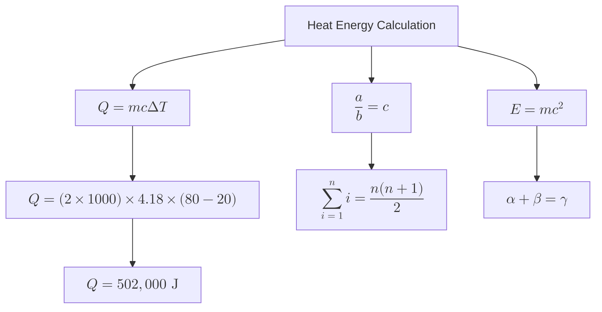
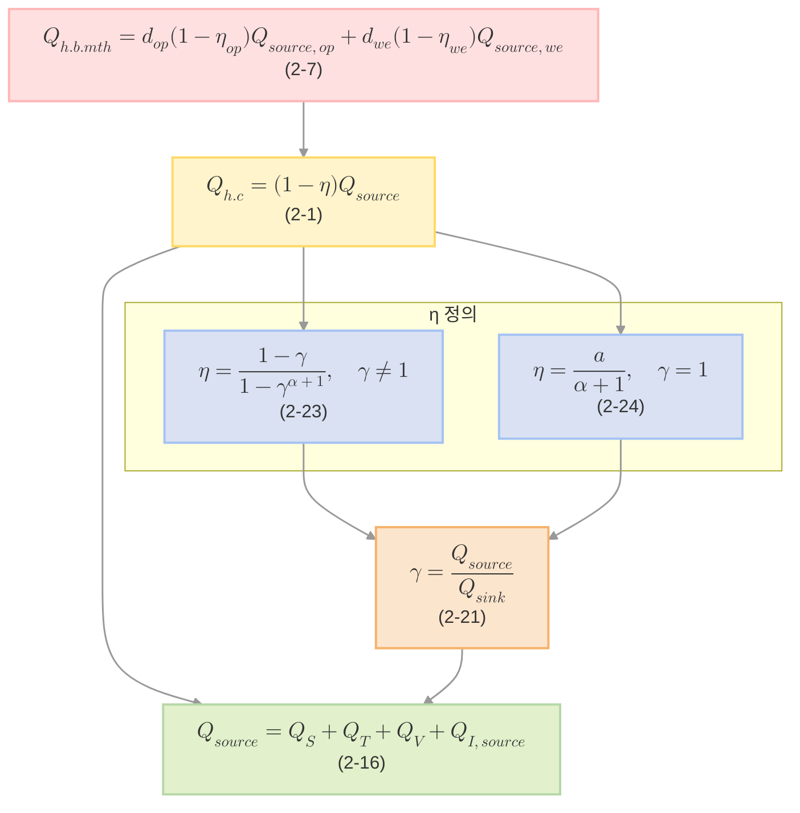
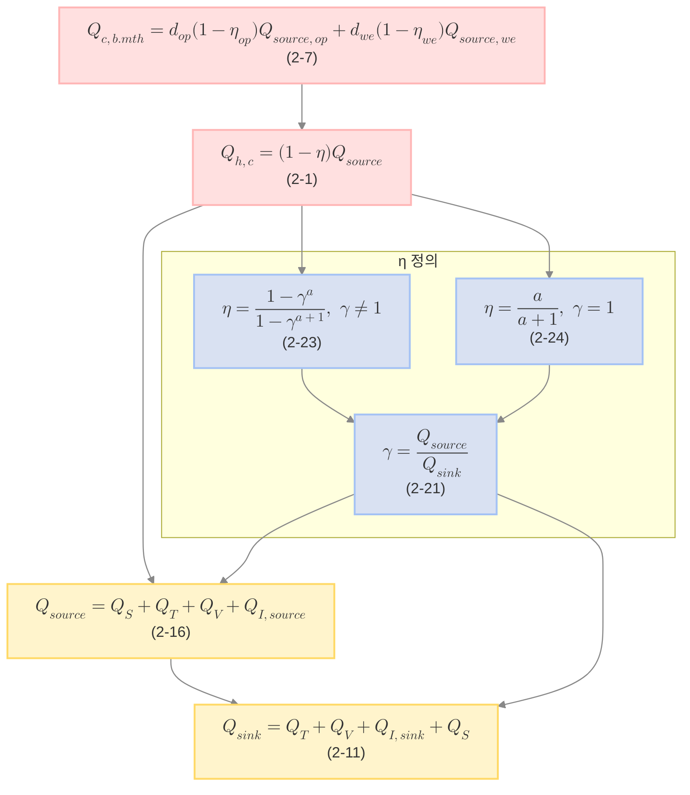

# Equation Diagram 
## 🔹 (Temporarily) Cooling Energy Demand Only
---




## Hee-Mind map sample
---

###TB ver.

```mermaid
graph TB

A["<div>$$Q_{h.b.mth} = d_{op}(1 - \eta_{op}) Q_{source,op} + d_{we}(1 - \eta_{we}) Q_{source,we}$$<br/>(2-7)</div>"]

B["<div>$$Q_{h.c} = (1 - \eta) Q_{source}$$<br/>(2-1)</div>"]

C["<div>$$Q_{source} = Q_S + Q_T + Q_V + Q_{I,source}$$<br/>(2-16)</div>"]

D["<div>$$\eta = \frac{1 - \gamma}{1 - \gamma^{\alpha + 1}}, \quad \gamma \neq 1$$<br/>(2-23)</div>"]

E["<div>$$\eta = \frac{a}{\alpha + 1}, \quad \gamma = 1$$<br/>(2-24)</div>"]

F["<div>$$\gamma = \frac{Q_{source}}{Q_{sink}}$$<br/>(2-21)</div>"]

G["<div>$$Q_{sink} = Q_T + Q_V + Q_{I,sink} + Q_S$$<br/>(2-11)</div>"]

%% 관계 연결
A --> B
B --> C
B --> D
B --> E
D --> F
E --> F
F --> C
F --> G

%% 노드 스타ì¼
style A fill:#FFE0E0,stroke:#FFB6B6,stroke-width:2px
style B fill:#FFF4CC,stroke:#FFD966,stroke-width:2px
style C fill:#E2F0CB,stroke:#B6D7A8,stroke-width:2px
style D fill:#D9E1F2,stroke:#A4C2F4,stroke-width:2px
style E fill:#D9E1F2,stroke:#A4C2F4,stroke-width:2px
style F fill:#FCE5CD,stroke:#F6B26B,stroke-width:2px
style G fill:#D9D2E9,stroke:#B4A7D6,stroke-width:2px

%% ì „ì²´ ë§í¬ 스타ì¼
linkStyle default stroke:#999,stroke-width:1.5px

```




###LR ver.



###TB+LR ver.




```mermaid
graph TB

%% 주요 식 흐름
A1["<div>$$Q_{c,b.mth} = d_{op}(1 - \eta_{op}) Q_{source,op} + d_{we}(1 - \eta_{we}) Q_{source,we}$$<br/>(2-7)</div>"]
A2["<div>$$Q_{h,c} = (1 - \eta) Q_{source}$$<br/>(2-1)</div>"]
A3["<div>$$Q_{source} = Q_S + Q_T + Q_V + Q_{I,source}$$<br/>(2-16)</div>"]
A4["<div>$$Q_{sink} = Q_T + Q_V + Q_{I,sink} + Q_S$$<br/>(2-11)</div>"]

A1 --> A2
A2 --> A3
A3 --> A4

%% η 관련 정의
subgraph ETA["η 정의"]
  direction LR
  B1["<div>$$\eta = \frac{1 - \gamma^a}{1 - \gamma^{a+1}},\quad \gamma \neq 1$$<br/>(2-23)</div>"]
  B2["<div>$$\eta = \frac{a}{a + 1},\quad \gamma = 1$$<br/>(2-24)</div>"]
  B3["<div>$$\gamma = \frac{Q_{source}}{Q_{sink}}$$<br/>(2-21)</div>"]
end

A2 --> B1
A2 --> B2
B1 --> B3
B2 --> B3
B3 --> A3
B3 --> A4

%% 스타일 정의
classDef red fill:#FFE0E0,stroke:#FFB6B6,stroke-width:2px;
classDef yellow fill:#FFF4CC,stroke:#FFD966,stroke-width:2px;
classDef blue fill:#D9E1F2,stroke:#A4C2F4,stroke-width:2px;

class A1,A2 red
class A3,A4 yellow
class B1,B2,B3 blue

linkStyle default stroke:#888,stroke-width:1.2px;


## 존의 냉방부하
```mermaid
graph LR

%% 상단 주요 흐름 (가로)
A1["<div>$$Q_{c,b.mth} = d_{op}(1 - \eta_{op}) Q_{source,op} + d_{we}(1 - \eta_{we}) Q_{source,we}$$<br/>(2-7)</div>"]
A2["<div>$$Q_{h,c} = (1 - \eta) Q_{source}$$<br/>(2-1)</div>"]
A3["<div>$$Q_{source} = Q_S + Q_T + Q_V + Q_{I,source}$$<br/>(2-16)</div>"]
A4["<div>$$Q_{sink} = Q_T + Q_V + Q_{I,sink} + Q_S$$<br/>(2-11)</div>"]

A1 --> A2 --> A3

%% η 관련 수식
subgraph ETA["η 정의"]
  direction TB
  B1["<div>$$\eta = \frac{1 - \gamma^a}{1 - \gamma^{a+1}},\ \gamma \neq 1$$<br/>(2-23)</div>"]
  B2["<div>$$\eta = \frac{a}{a + 1},\ \gamma = 1$$<br/>(2-24)</div>"]
  B3["<div>$$\gamma = \frac{Q_{source}}{Q_{sink}}$$<br/>(2-21)</div>"]
end

A2 --> B1
A2 --> B2
B1 --> B3
B2 --> B3
B3 --> A3
B3 --> A4

%% a, τ 정의 및 흐름
subgraph TAU["a 및 τ 정의"]
  direction LR
  C1["<div>$$a = a_0 + \frac{\tau}{\tau_0},\ a_0 = 1,\ \tau_0 = 16h$$<br/>(2-25)</div>"]
  C2["<div>$$\tau = \frac{C_{wirk}}{\Sigma H_{T,j} + \Sigma H_{V,k} + H_{V,mech,\theta}}$$<br/>(2-22,129)</div>"]
end

B1 --> C1
B2 --> C1
C1 --> C2

%% H_T, H_V, C_wirk 정의
subgraph HEAT_LOSS["열손실 관련"]
  direction LR
  D1["<div>$$H_{T,D} = \Sigma(U_j A_j) + \Delta U_{WB} \Sigma A_j$$<br/>(2-44)</div>"]
  D2["<div>$$H_{T,iu} = \Sigma(U_j A_j)$$<br/>(2-48)</div>"]
  D3["<div>$$H_{T,iz} = \Sigma(U_j A_j)$$<br/>(2-52)</div>"]
  D4["<div>$$H_{T,s}$$ DIN EN ISO 13370</div>"]
  E1["<div>$$H_{V,inf} = n_{inf} V c_{p,a} \rho_a$$<br/>(2-58)</div>"]
  E2["<div>$$H_{V,mech} = n_{mech} V c_{p,a} \rho_a$$<br/>(2-83)</div>"]
  E3["<div>$$H_{V,ue} = n_{ue} V_u c_{p,a} \rho_a$$<br/>(2-94)</div>"]
  E4["<div>$$H_{V,z} = \dot{V}_{z,d} c_{p,a} \rho_a$$<br/>(2-99)</div>"]
  E5["<div>$$H_{V,mech,\theta} = H_{V,mech} \cdot \frac{\theta_{i,h.soll} - \theta_{V,mech}}{6K}$$<br/>(2-130)</div>"]
end

C2 --> D1
C2 --> D2 
C2 --> D3 
C2 --> D4 
C2 --> E1 
C2 --> E2 
C2 --> E3 
C2 --> E4 
C2 --> E5

%% C_wirk 값
subgraph CWIRK["C_{wirk} 값"]
  direction TB
  F1["<div>$$C_{wirk} = 50\ \text{Wh}/(\text{m}^2 \cdot \text{K}) \cdot A_B$$<br/>(2-126)</div>"]
  F2["<div>$$C_{wirk} = 90\ \text{Wh}/(\text{m}^2 \cdot \text{K}) \cdot A_B$$<br/>(2-127)</div>"]
  F3["<div>$$C_{wirk} = 130\ \text{Wh}/(\text{m}^2 \cdot \text{K}) \cdot A_B$$<br/>(2-128)</div>"]
end

C2 --> F1
C2 --> F2
C2 --> F3

%% 조건 분기
subgraph CONDITIONS["조건 분기"]
  direction TB
  G1["<div>$$1 - (\eta \gamma) < 0.01 \Rightarrow \eta = \frac{1}{\gamma},\ Q_{h,b} = 0$$<br/>(2-137)</div>"]
  G2["<div>$$(1 - \eta)\gamma < 0.01 \Rightarrow \eta = 1,\ Q_{c,b} = 0$$<br/>(2-138)</div>"]
  G3["<div>$$\dot{V}_{mech} \ge \frac{\dot{Q}_{C,max}}{c_p \rho_a (\theta_i - \theta_{mech})} \Rightarrow \eta = 1$$<br/>(2-139)</div>"]
end

B1 --> G1 --> B3
B1 --> G2 --> B3
B1 --> G3 --> B3
B2 --> G1 --> B3
B2 --> G2 --> B3
B2 --> G3 --> B3

%% 스타일 정의
classDef red fill:#FFE0E0,stroke:#FFB6B6,stroke-width:2px;
classDef yellow fill:#FFF4CC,stroke:#FFD966,stroke-width:2px;
classDef green fill:#E2F0CB,stroke:#B6D7A8,stroke-width:2px;
classDef blue fill:#D9E1F2,stroke:#A4C2F4,stroke-width:2px;
classDef orange fill:#FCE5CD,stroke:#F6B26B,stroke-width:2px;
classDef violet fill:#EAD1DC,stroke:#D5A6BD,stroke-width:2px;

class A1,A2 red
class A3,A4 yellow
class B1,B2,B3 blue
class C1,C2 orange
class D1,D2,D3,D4,E1,E2,E3,E4,E5 green
class F1,F2,F3 violet
class G1,G2,G3 red

linkStyle default stroke:#888,stroke-width:1.2px;
```