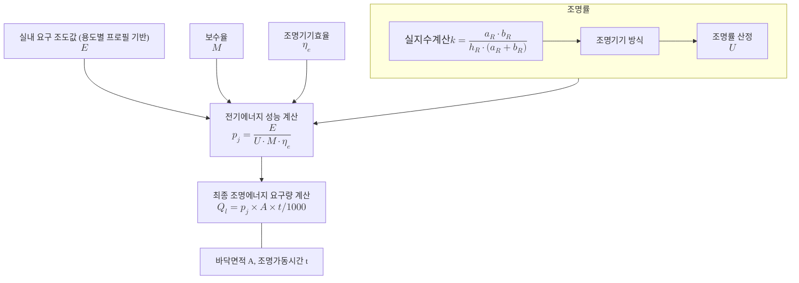

# 조명 에너지요구량
## 조명 에너지요구량  \(Q_{l}\) (Lighting energy demand) 
### 조명 에너지요구량 계산

아래 그림은 존의 전기적 조명 부하를 바탕으로 조명 에너지요구량을 산정하는 프로세스를 도식화한 것입니다.

**박스 안에 글씨와 수식을 깔끔하게 함께 표현하는 방법이 좀 어렵네요. 가능하다면 희가 ppt로 작업해주면 좋을 것 같습니다!**

 

각 존 \(j\)의 조명에 사용되는 에너지요구량을 산정하기 위해서는 해당 존에 대한 **전기에너지 성능 (\(p_j\))**을 산출하여야 하며, 이를 위해 각 존의 **실내 요구 조도값 (\(E\)), 실지수 (\(k\)), 조명률 (\(U\)), 보수율 (\(M\)), 조명기기 효율 (\(\eta_e\))**이 파악되어야 합니다. 산출된 **전기에너지 성능**에 **바닥면적 (\(A_j\))**과 **전등의 가동시간 (\(t\))**을 곱하여 존 \(j\)에 대한 에너지요구량을 산정합니다. 

 
다음은 \(Q_{l}\) 계산식입니다:  

  

 \( Q_{l,j} = p_j \cdot A_j \cdot t / 1000 \)
  

<!-- ✅ Where 이하: 완전히 별도의 블록으로 분리 -->

  

    <!-- Where 텍스트: 독립적, 굵고 이탤릭 -->
    

      Where,
    

    <!-- 수식 설명들: 왼쪽 정렬, Pretendard 유지 -->
    \( Q_{l,j} \) : \(Zone\ j\)의 조명 에너지요구량 (\( kWh \))
    \( p_j \) : \(Zone\ j\)의 전기에너지 성능 (\( W/m^2 \))
    \( A_j \) : \(Zone\ j\)의 바닥 면적 (\(/m^2 \))
    \( t \) : \(Zone\ j\)의 조명시스템 가동시간 (\( h\))
  

 

&nbsp; 

---

### 전기에너지 성능 계산

조명의 전기에너지 성능 (\(p_j\))은 실내 요구 조도, 조명률, 보수율, 조명기기 효율 등에서 구할 수 있습니다. 여기서, 실내 요구 조도는 용도별 프로필에서 해당 용도에 맞는 요구 조도를 사용하도록 합니다. 
\(p_j\) 는 다음과 같이 계산됩니다:  

  

 \( p_j = \frac{E}{U \cdot M \cdot \eta_e } \)
  

<!-- ✅ Where 이하: 완전히 별도의 블록으로 분리 -->

  

    <!-- Where 텍스트: 독립적, 굵고 이탤릭 -->
    

      Where,
    

    <!-- 수식 설명들: 왼쪽 정렬, Pretendard 유지 -->
    \( p_j \) : 요구조도를 만족하기 위한 전기에너지 성능 (\( W/m^2 \))
    \( U \) : 조명률 
    \( E \) : 실내 요구 조도값 (\( lx \))
    \( M \) : 보수율
    \( \eta_e \) : 조명기기효율 (\( lm/W \))
  

전기에너지 성능 산정 시 필수 구성 요소는 아래 표와 같습니다: 

| 주요 요소                   | 정의 및 영향 요인                 | 수식/참고                                             |
| -------------------- | ------------------------ | ------------------------------------------------- |
| **실내 요구 조도값 $E$** | 용도별 프로필에서 해당 용도에 맞는 요구 조도를 사용하도록 함 | 용도별 프로필 참고
| **실지수 $k$**          | 공간의 형상(깊이, 너비, 조명고)에 따라 결정되며, 조명률 산정에 사용     | $k = \frac{a_R \cdot b_R}{h_R \cdot (a_R + b_R)}$ |
| **조명률 $U$**          | 광원의 총광속 대비 작업면에 도달하는 유효광속의 비율. 조명기기 방식 및 반사율에 따라 달라짐 | 표 3.2.6-1 참고                                      |
| **보수율 $M$**          | 초기 조도 대비 유지 조도 비율. 설비 노후, 오염 등 고려            | $M = E_t / E_i$                                   |
| **조명기기 효율 $\eta_e$** | 단위 전력당 발산 광속. 광원 종류 및 성능에 따라 상이함           | 표 3.2.6-2 참고                                      |

---

#### 실지수 \(k\)

실지수는 실의 형상을 나타내는 지수로, 실 형상에 따라 광원에서 작업면에 직접 도달하는 빛과 천장, 벽, 바닥에서 반사되어 오는 빛이 달라집니다. 따라서 가로, 세로, 광원읜 높이의 관계를 고려하는 값이 실지수 \(k\) 입니다. \(k\) 는 다음과 같이 계산됩니다:  

  

 \( k = \frac{a_R \cdot b_R}{h_R \cdot (a_R + b_R)} \)
  

<!-- ✅ Where 이하: 완전히 별도의 블록으로 분리 -->

  

    <!-- Where 텍스트: 독립적, 굵고 이탤릭 -->
    

      Where,
    

    <!-- 수식 설명들: 왼쪽 정렬, Pretendard 유지 -->
    \( a_R \) : 실내 공간 깊이 (m)
    \( b_R \) : 실내 공간 너비 (m)
    \( h_R \) : 전등이 위치한 곳과 작업면의 높이 차이 (m)
  

#### 조명률 \(U\)

조명률이란 광원에서 나온 총 빛에 대한 작업면에 도달하는 빛의 비율을 나타내며 일반적으로 1보다 작은 값으로 표시됩니다. 조명률 산출은 <표 3.2.6-1>에 해당하는 값을 적용합니다 (단, 실내 마감재의 반사율을 바닥 0.2, 벽 0.5, 천정 0.7로 설정한 경우에 해당). 

<!DOCTYPE html>
<html lang="ko">
<head>
  <meta charset="UTF-8">
  <title>조명기기 방식 별 실지수 k</title>
  
</head>
<body>
  <table>
    <caption style="caption-side: top; text-align: left; font-size: 16px; font-weight: bold; margin-bottom: 12px;">
      표 3.2.6-1. 조명기기 방식별 실지수(k)
    </caption>
    <tr>
      <th rowspan="2">조명기기 방식</th>
      <th colspan="11">실지수 <i>k</i></th>
    </tr>
    <tr>
      <th>0.6</th><th>0.8</th><th>1</th><th>1.25</th><th>1.5</th><th>2</th><th>2.5</th><th>3</th><th>4</th><th>5</th>
    </tr>
    <tr>
      <td class="left">직접(백열등)</td>
      <td>0.48</td><td>0.53</td><td>0.56</td><td>0.59</td><td>0.62</td><td>0.65</td><td>0.67</td><td>0.69</td><td>0.71</td><td>0.72</td>
    </tr>
    <tr>
      <td class="left">직접(형광등)</td>
      <td>0.3</td><td>0.37</td><td>0.42</td><td>0.46</td><td>0.49</td><td>0.54</td><td>0.57</td><td>0.59</td><td>0.61</td><td>0.63</td>
    </tr>
    <tr>
      <td class="left">간접/반간접</td>
      <td>0.15</td><td>0.19</td><td>0.22</td><td>0.26</td><td>0.28</td><td>0.32</td><td>0.35</td><td>0.37</td><td>0.4</td><td>0.42</td>
    </tr>
  </table>
</body>
</html>

#### 보수율 \(M\)

보수율 (\(M\))이란 조명시설을 일정한 기간 사용한 후의 작업면 상의 평균 조도와 초기 조도와의 비를 의미합니다. 설비의 사용시간이 경과하면서 조명효율이 감소하기 때문에 이와 같은 조도 저하를 보완하기 위해 조도를 계산하는 과정에서 보정계수 (보수율)를 설정합니다. 보수율은 일반적으로 0.85~0.65의 값을 채택하게 됩니다. \(M\) 은 다음과 같이 계산됩니다:

  

 \( M = \frac{E_t}{E_i} \)
  

<!-- ✅ Where 이하: 완전히 별도의 블록으로 분리 -->

  

    <!-- Where 텍스트: 독립적, 굵고 이탤릭 -->
    

      Where,
    

    <!-- 수식 설명들: 왼쪽 정렬, Pretendard 유지 -->
    \( E_t \) : 확보 조도 (조명기구의 청소, 오래된 전등의 교환 등을 행하기 이전 조도)
    \( E_i \) : 초기 조도 (조명기구, 전등 등의 초기 설치 시 얻어지는 조도)
  

#### 조명기기 효율 \(\eta_e\)

조명기기 효율 (\(\eta_e\))는 단위에너지 당 발생되는 광속을 의미하며 광원의 종류 및 제품에 따라 성능에 차이가 있습니다. 제품의 성능 성적서가 주어지는 경우 제시된 값을 사용하도록 하고, 성적서가 없는 경우 다음 <표 3.2.6-2>에 주어진 표준값을 사용합니다. 

<!DOCTYPE html>
<html lang="ko">
<head>
  <meta charset="UTF-8">
  <title>램프종류별 조명기기효율</title>
  
</head>
<body>
  <table>
    <caption style="caption-side: top; text-align: left; font-size: 16px; font-weight: bold; margin-bottom: 12px;">
      표 3.2.6-2. 램프 종류 별 조명기기 효율
    </caption>
    <tr>
      <th rowspan="2">기기효율</th>
      <th colspan="7">램프종류</th>
    </tr>
    <tr>
      <th>백열등 100 W</th>
      <th>할로겐등 500 W</th>
      <th>형광등 40 W</th>
      <th>형광등 100 W</th>
      <th>고압수은등 400 W</th>
      <th>메탈할라이드등 400 W</th>
      <th>고압나트륨등 400 W</th>
    </tr>
    <tr>
      <td>조명기기효율 (안정기손실 포함) lm/W</td>
      <td>15</td>
      <td>21</td>
      <td>65</td>
      <td>79</td>
      <td>52</td>
      <td>72</td>
      <td>108</td>
    </tr>
  </table>
</body>
</html>
