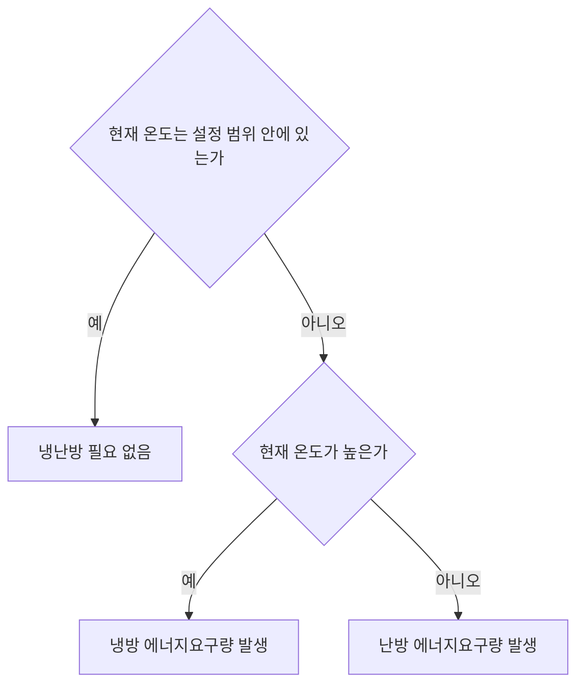

# 냉방 및 난방 에너지요구량

어떤 존의 온도가 **설정 범위 내**에 있다면 추가적으로 냉방 또는 난방을 할 필요가 없을 것입니다.   
그러나 설정 범위를 벗어난다면, 다음과 같이 **냉방** 또는 **난방 에너지요구량**이 발생하게 됩니다.  
 

 

## 1. 냉방 에너지요구량  \(Q_{c,b}\) (Cooling energy demand) 
### 🔹 건축물의 냉방 에너지요구량 계산
설정 범위보다 온도가 **높을 때** 냉방 에너지요구량이 발생합니다.   
즉 어떤 존의 냉방 에너지요구량, \(Q_{c,b}\)은 시스템에 의해 **제거되어야 할 유효 열량**을 계산함으로써 구해집니다.  
 
\(Q_{c,b}\) 는 다음과 같이 계산됩니다:  

  

 \( Q_{c,b} = (1-\eta) Q_{source} \quad \text{(2–1)} \)
  

<!-- ✅ Where 이하: 완전히 별도의 블록으로 분리 -->

  

    <!-- Where 텍스트: 독립적, 굵고 이탤릭 -->
    

      Where,
    

    <!-- 수식 설명들: 왼쪽 정렬, Pretendard 유지 -->
    \( Q_{c,b} \) : \(Zone\ i\)의 냉방 에너지요구량 
    \( \eta_i \) : 열획득 이용률
    \( Q_{source,i} \) : \(Zone\ i\)의 열획득
  

 

- 어떤 존(zone) \(i\)의 **연간** 냉방에너지요구량을 구하기 위해, 월별로 **월간**🗓️ 냉방 에너지요구량을 구하고 이를 합산합니다. 
[&nbsp;&nbsp;&nbsp;&nbsp;🔍 건물의 조닝(zoning)에 대한 로직 바로가기](../a/Zoning.md)
- **월간** 냉방 에너지요구량은 **일간** 냉방 에너지요구량의 한달치 계산이 됩니다.
- 연중 월간 열획득 및 이용률 값이 모두 다르므로, 월별 냉방 에너지요구량 값은 모두 상이합니다. 
[&nbsp;&nbsp;&nbsp;&nbsp;🔍 열획득과 열손실에 대한 로직 바로가기](../a/Heat_gain_loss.md)
[&nbsp;&nbsp;&nbsp;&nbsp;🔍 (이용률 등) 개별 값 설정에 대한 로직 바로가기](../a/Value.md)

&nbsp; 

---

### 🔹 건축물의 **연간** 냉방 에너지요구량: 🗓️ 월별 요구량의 합
#### 🔘 연간 냉방 에너지요구량 \(Q_{c,b}\) = \( \sum \) 월간 냉방 에너지요구량</h4>
<figure style="text-align: center;">
  
  <figcaption><strong>Annual cooling energy demand</strong></figcaption>
</figure>

&nbsp; 

---

### 🔹 **월간** 냉방에너지요구량 \(Q_{c,b}\)
#### 🔘 월간 냉방 에너지요구량 \(Q_{c,b, mth}\) = \( \sum \) 일간 냉방 에너지요구량</h4>

\(Q_{c,b, mth}\)는 다음과 같이 계산됩니다:      

  

    {{ include_equations("2", 7, 7) }}
  

<!-- ✅ Where 이하: 완전히 별도의 블록으로 분리 -->

  

    <!-- Where 텍스트: 독립적, 굵고 이탤릭 -->
    

      Where,
    

    <!-- 수식 설명들: 왼쪽 정렬, Pretendard 유지 -->
    \( Q_{c,b,mth} \) : 월간 냉방 에너지요구량
    \( d_{op} \) : 주중 일수
    \( \eta_op \) : 주중 열획득 이용률
    \( Q_{source,op} \) : 주중 열획득
    \( d_{we} \) : 주말 일수
    \( \eta_we \) : 주말 열획득 이용률  
    \( Q_{source,we} \) : 주말 열획득
  

 

- 1개월은 **주중** 및 **주말**로 구성됩니다.   
- 주중 및 주말 여부에 따라 운영스케줄이 다르기 때문에 **일간** 냉방 에너지요구량 또한 달라집니다. 

<figure style="text-align: center;">
  
  <figcaption><strong>Monthly cooling energy demand</strong></figcaption>
</figure>

## 난방 에너지요구량  \(Q_{h,b}\) (Heating energy demand) 
### 🔹 건축물의 난방 에너지요구량 계산

설정 범위보다 온도가 **낮을 때** 난방 에너지요구량이 발생합니다. 즉 어떤 존의 난방 에너지요구량, \(Q_{h,b}\)은 시스템에 의해 **보충되어야 할 유효 열량**을 계산함으로써 구해집니다.  
 
\(Q_{h,b}\) 는 다음과 같이 계산됩니다:  

  

    {{ include_equations("2", 1, 1) }}
  

<!-- ✅ Where 이하: 완전히 별도의 블록으로 분리 -->

  

    <!-- Where 텍스트: 독립적, 굵고 이탤릭 -->
    

      Where,
    

    <!-- 수식 설명들: 왼쪽 정렬, Pretendard 유지 -->
    \( Q_{h,b,i} \) : \(Zone\ i\)의 난방 에너지요구량
    \( Q_{sink,i} \) : \(Zone\ i\)의 열손실
    \( \eta_i \) : 열획득 이용률
    \( Q_{source,i} \) : \(Zone\ i\)의 열획득
  

- 어떤 존(zone) \(i\)의 **연간** 난방에너지요구량을 구하기 위해, 월별로 **월간**🗓️ 난방 에너지요구량을 구하고 이를 합산합니다. 
[&nbsp;&nbsp;&nbsp;&nbsp;🔍 건물의 조닝(zoning)에 대한 로직 바로가기](../a/Zoning.md)
- **월간** 난방 에너지요구량은 **일간** 난방 에너지요구량의 한달치 계산이 됩니다.
- 연중 월간 열획득 및 이용률 값이 모두 다르므로, 월별 난방 에너지요구량 값은 모두 상이합니다. 
[&nbsp;&nbsp;&nbsp;&nbsp;🔍 열획득과 열손실에 대한 로직 바로가기](../a/Heat_gain_loss.md)
[&nbsp;&nbsp;&nbsp;&nbsp;🔍 (이용률 등) 개별 값 설정에 대한 로직 바로가기](../a/Value.md)

&nbsp; 

---

### 🔹 건축물의 **연간** 난방 에너지요구량: 🗓️ 월별 요구량의 합
#### 🔘 연간 난방 에너지요구량 \(Q_{h,b}\) = \( \sum \) 월간 난방 에너지요구량</h4>
<figure style="text-align: center;">
  
  <figcaption><strong>Annual cooling energy demand</strong></figcaption>
</figure>

&nbsp; 

---

### 🔹 **월간** 난방에너지요구량 \(Q_(h,b)\)
#### 🔘 월간 난방 에너지요구량 \(Q_{h,b, mth}\) = \( \sum \) 일간 난방 에너지요구량</h4>

\(Q_{h,b, mth}\)는 다음과 같이 계산됩니다:      

  

    {{ include_equations("2", 6, 6) }}
  

<!-- ✅ Where 이하: 완전히 별도의 블록으로 분리 -->

  

    <!-- Where 텍스트: 독립적, 굵고 이탤릭 -->
    

      Where,
    

    <!-- 수식 설명들: 왼쪽 정렬, Pretendard 유지 -->
    \( Q_{h,b,mth} \) : 월간 난방 에너지요구량
    \( d_{op} \) : 주중 일수
    \( \eta_op \) : 주중 열획득 이용률
    \( Q_{source,op} \) : 주중 열획득
    \( d_{we} \) : 주말 일수
    \( \eta_we \) : 주말 열획득 이용률  
    \( Q_{source,we} \) : 주말 열획득
  

 

- 1개월은 **주중** 및 **주말**로 구성됩니다.   
- 주중 및 주말 여부에 따라 운영스케줄이 다르기 때문에 **일간** 난방 에너지요구량 또한 달라집니다. 

<figure style="text-align: center;">
  
  <figcaption><strong>Monthly cooling energy demand</strong></figcaption>
</figure>
