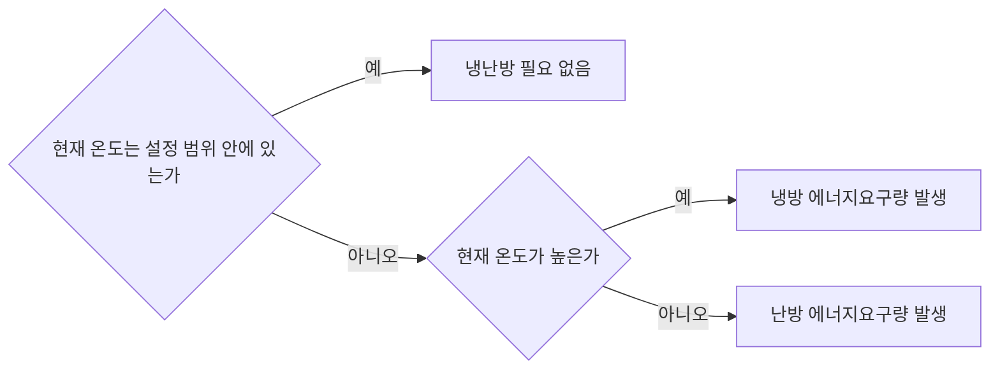
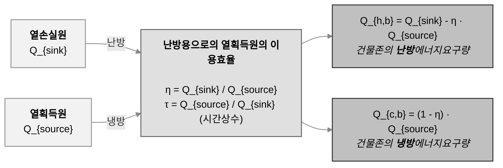
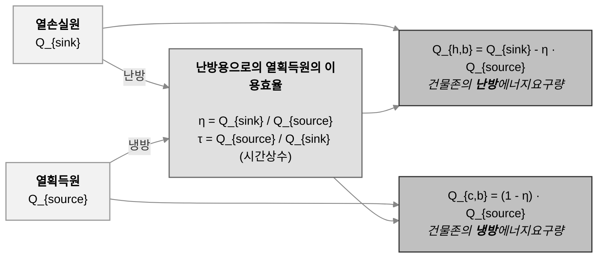

# 냉방 및 난방 에너지요구량

어떤 존의 온도가 설정 범위 내에 있다면 추가적으로 냉방 또는 난방을 할 필요가 없을 것입니다. 그러나 설정 범위를 벗어난다면, 다음과 같이 냉방 또는 난방 에너지요구량이 발생하게 됩니다:   
<br><br>

<br>
---

## 냉방에너지요구량  \(Q_{c,b}\) (Cooling energy demand) 
설정 범위보다 온도가 **높을 때** 냉방 에너지요구량이 발생합니다. 즉 어떤 존의 단위면적당 냉방 에너지요구량, \(Q_{c,b}\)은 **시스템에 의해 제거되어야 할 유효 열량**을 계산함으로써 구해집니다.  
<br>
\(Q_{c,b}\) 는 다음과 같이 계산됩니다:  

<div style="text-align: center; margin-top: 24px; margin-bottom: 24px;">
  <div style="
    display: inline-block;
    background-color: #F1F5F9;
    border-radius: 10px;
    padding: 16px 48px;
    line-height: 1.8;
    margin-top: 1em;
    margin-bottom: 2em;
  ">
 \( Q_{c,b} = (1-\eta) Q_{source} \quad \text{(2–1)} \)
  </div>
</div>

<h6>       희야, 이 식이 수식 폴더에 없는 것 같아서 한번만 확인 부탁해! 수식 만들고, 링크도 적용시켜줘 </h6>


<table>
  <thead>
    <tr>
      <th>제품</th>
      <th>가격</th>
      <th>색상</th>
    </tr>
  </thead>
  <tbody>
    <tr>
      <td>사과</td>
      <td>100</td>
      <td>빨강</td>
    </tr>
    <tr>
      <td>바나나</td>
      <td>80</td>
      <td>노랑</td>
    </tr>
  </tbody>
</table>


<div class="center-table">

| Column A | Column B | Column C |
|----------|----------|----------|
| Apple    | 100      | Red      |
| Banana   | 80       | Yellow   |
| Cherry   | 120      | Dark Red |

</div>


### 냉방에너지요구량 계산을 위한 📐공간 및 🗓️시간 구분
- 한 건축물의 연간 냉방에너지요구량을 구하기 위해, 건축물을 공간적 및 시간적으로 분할하여 각 냉방에너지요구량을 구합니다.   
- 📐 공간은 <strong>존(zone)</strong> 단위로 구분되며 <strong>모든 존별 단위면적당 냉방에너지요구량의 합</strong>이 비로소 건축물의 단위면적당 냉방에너지요구량이 됩니다. <span style="font-size: 0.9em; font-style: italic;">[&nbsp;&nbsp;&nbsp;&nbsp;🔍 조닝(zoning)에 대한 로직 바로가기](../1.%20ECO2%20Logic%20Guide/Zoning.md)</span>
- 🗓️ 한편 1개 존의 연간 단위면적당 냉방에너지요구량은 <strong>월별 단위면적당 냉방에너지요구량의 총합</strong>이 됩니다.

<div style="display: flex; gap: 0.5em; align-items: stretch;">
    <div style="
    flex: 1;
    background: #f0f8ff;
    border: 1px solid #aad4ff;
    border-radius: 8px;
    padding: 20px;
    display: flex;
    flex-direction: column;
    justify-content: space-between;
  ">
    <h4> 🔹 건축물의 연간 단위면적당 냉방에너지요구량: 📐 존별 요구량의 합</h4>
    <h5></h5>
    <p>이곳은 왼쪽 단의 내용입니다.</p>
  </div>
    <div style="
    flex: 1;
    background: #f0f8ff;
    border: 1px solid #aad4ff;
    border-radius: 8px;
    padding: 20px;
    display: flex;
    flex-direction: column;
    justify-content: space-between;
  ">
    <h4> 🔹 건축물의 연간 단위면적당 냉방에너지요구량: 🗓️ 월별 요구량의 합</h4>
    <h5>연간 단위면적당 냉방에너지요구량 \(Q_{c,b}\)</h5>
    <p><center>
  
  <div><strong>Annual cooling energy demand</strong></div>
</center>
</p>
  </div>
</div>
2. 설정 범위보다 온도가 낮을 때: 난방 에너지요구량이 발생 🔥 \(Q_{h,b} > 0\)   


&nbsp;<br>

### 🔹 **월간** 단위면적당 냉방에너지요구량 \(Q_{c,b}\)

&nbsp;<br>

<center>
  
  <div><strong>Monthly cooling energy demand</strong></div>
</center>

&nbsp;<br>

1개월은 주중 및 주말일수로 구성되고,  
주중 및 주말 여부에 따라 1일 단위면적당 냉방에너지요구량이 달라짐

{{ include_equations("2", 7, 7) }}  

where 
<em>Q<sub>source</sub></em> : 열획득원  
&eta;: 열획득 이용률(소진율) 

##### 🚩 열획득 이용률(&eta;): 열획득원(<em>Q<sub>source</sub></em> )에 의한 냉방에너지요구량(<em>Q<sub>c, b</sub></em> )의 정도를 결정 
&gamma; 및 <em>a </em>의 값에 따라 열획득 이용률(&eta;)이 결정  

{{ include_equations("2", 23, 24) }}  


<details open>
  <summary><strong> 두 단 전체 열고 닫기</strong></summary>

  <div style="display: flex; gap: 2em; margin-top: 1em;">
    <!-- 왼쪽 단 -->
    <div style="flex: 1;">
      <h4>🔹 왼쪽 단</h4>
      <p>왼쪽 단의 내용입니다.</p>
    </div>

    <!-- 오른쪽 단 -->
    <div style="flex: 1;">
      <h4>🔸 오른쪽 단</h4>
      <p>오른쪽 단의 내용입니다.</p>
    </div>
  </div>

</details>


{{ include_equations("2", 138, 138) }}  

<details>
  <summary style="font-weight: bold; font-size: 1.1em;">▼ 수식 설명 보기</summary>
  <div style="display: flex; gap: 2em; margin-top: 1em;">
    <div style="flex: 1;">
      <h3>왼쪽 단</h3>
      <p>이곳은 왼쪽 단의 내용입니다. 예: 수식에 사용된 변수 설명</p>
    </div>
    <div style="flex: 1;">
      <h3>오른쪽 단</h3>
      <p>이곳은 오른쪽 단의 내용입니다. 예: 실제 적용 사례나 계산 예시</p>
    </div>
  </div>
</details>


###### 열획득 이용률(&eta;) ＝ 1이면 이 존의 냉방에너지요구량(<em>Q<sub>c, b</sub></em> ) = 0


###### 열획득 이용률(&eta;) ≠ 1


<div style="display: flex; gap: 2em;">

  <!-- 왼쪽 단 -->
  <div style="flex: 1;">
    <details open>
      <summary><strong>🔹 왼쪽 단 제목</strong></summary>
      <p>여기는 왼쪽 단 내용입니다.</p>
      <p>원한다면 수식도 가능: \( Q = mc\Delta T \)</p>
    </details>
  </div>

  <!-- 오른쪽 단 -->
  <div style="flex: 1;">
    <details>
      <summary><strong>🔸 오른쪽 단 제목</strong></summary>
      <p>여기는 오른쪽 단 내용입니다.</p>
      <ul>
        <li>항목 1</li>
        <li>항목 2</li>
      </ul>
    </details>
  </div>

</div>


<div style="border: 1px solid red; padding: 1em;">
This is raw HTML in Markdown.
</div>

<div style="display: flex; gap: 2em;">
  <div style="flex: 1;">
    <h3>왼쪽 단</h3>
    <p>이곳은 왼쪽 단의 내용입니다.</p>
  </div>
  <div style="flex: 1;">
    <h3>오른쪽 단</h3>
    <p>이곳은 오른쪽 단의 내용입니다.</p>
  </div>
</div>


<details open>
<summary><strong>🔹 단 1: 입력 조건</strong></summary>

여기에 첫 번째 단의 내용을 씁니다.  
예: 외기온도, 실내 목표온도, 난방/냉방 조건 등...

</details>

<details>
<summary><strong>🔸 단 2: 계산식 및 결과</strong></summary>

여기는 두 번째 단입니다.  
$$ Q_{cooling} = (1 - \eta) \cdot Q_{source} $$

</details>


<center>
  
  <div><strong>Figure 1. Energy Flow Diagram</strong></div>
</center>

---

## 🔹 냉방기기 설정 항목 및 계산 로직

### **1. [일반데이터]**
- **냉동기 방식** → 압축식 / 흡수식 선택
- **냉동기 총 용량 (kW)** → 냉방 부하 계산 시 필수 값
- **정격열성능지수 (COP)** → 냉동기 효율을 평가하는 지표

**🔹 계산식:**
```python
COP = Q_output / W_input
```

---

### **2. [신재생 및 열병합 시스템 연결여부]**
- **신재생 시스템 연결 여부** → 시스템 연결 여부 선택
- **연결된 시스템** → 지열 냉난방, 태양열 시스템 등 선택
- **적용된 입력존 수** → 시스템 적용 범위 지정

**🔹 신재생 시스템 반영 시 부하 보정식:**
```python
Q_total = Q_cooling - Q_renewable
```

---

### **3. [압축식 냉동기]**
- **압축식 냉동기 종류** → 공기 간격식, 수냉식 등 선택
- **냉동기 압축방식** → 왕복동식, 스크류 압축기 등 선택
- **제어방식** → On/Off 제어, PID 제어 등 선택

**🔹 냉방 부하 계산:**
```python
Q_cooling = Q_sensible + Q_latent
```
- \( Q_{sensible} \) : 현열 부하 (온도 조절)
- \( Q_{latent} \) : 잠열 부하 (습도 조절)

---

### **4. [흡수식 냉동기]**
- **열원과 연결 방식** → 외부 보일러 등 열원 선택
- **사용 연료** → 도시가스, 전기, 증기 등 선택
- **냉동기 종류** → 단효용, 이중효용 등 효율에 따라 구분

**🔹 흡수식 냉동기 열원 계산:**
```python
Q_absorption = Q_cooling / 효율
```

---

### **5. [재냉각기 (냉각탑)]**
- **종말식 또는 건식냉각기** → 냉각 방식 선택 (없음, 공기냉각 등)
- **냉각탑의 보조냉각기 유무** → 부가적으로 설치된 냉각기 여부

**🔹 냉각탑 열 방출 계산:**
```python
Q_tower = m_dot * Cp * (T_in - T_out)
```
- \( m_dot \) : 냉각수 유량
- \( C_p \) : 물의 비열 (4.18 kJ/kg·K)
- \( T_{in}, T_{out} \) : 냉각탑 입/출구 온도

---

## 🔹 Key Formula
The core equation for heat energy calculation is:

$$
Q = mc\Delta T
$$

Where:  
- **Q** = Heat energy (Joules)  
- **m** = Mass (kg)  
- **c** = Specific heat capacity (J/kg·K)  
- **ΔT** = Temperature change (K)

---

## 🔹 Example Calculation
Let's calculate the energy required to heat 2 kg of water from 20°C to 80°C. Assuming water's specific heat capacity is \( 4.18 \ \mathrm{J/g \cdot K} \).  

$$
Q = (2 \times 1000) \times 4.18 \times (80 - 20) = 502,000 \ \text{J}
$$


🎨 Request to Hee ➡️ 적절히 도식화 요청
---




주중 1일 단위면적당 냉방에너지요구량 × 주중 일수  
주말 1일 단위면적당 냉방에너지요구량 × 주말 일수
▶ 1개월 단위면적당 냉방에너지요구량 
1일(i?) 기준 1개 존 단위면적당 냉방에너지요구량 (<em>Q<sub>c, b</sub></em> )📍