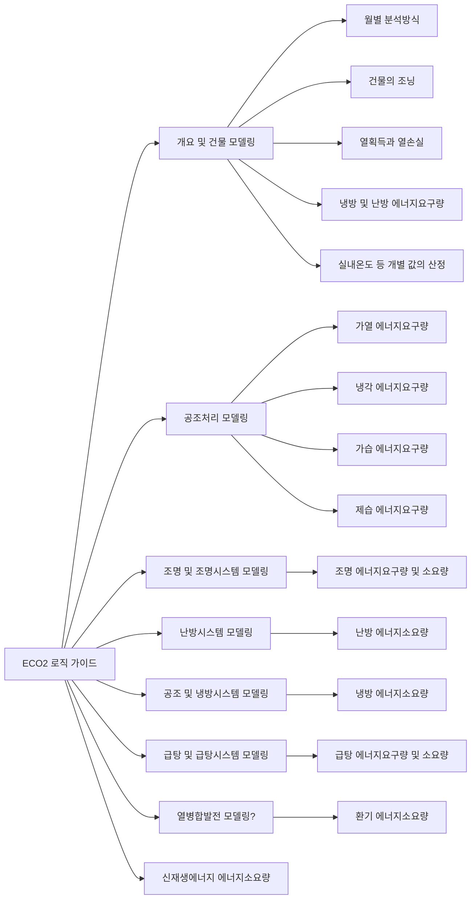
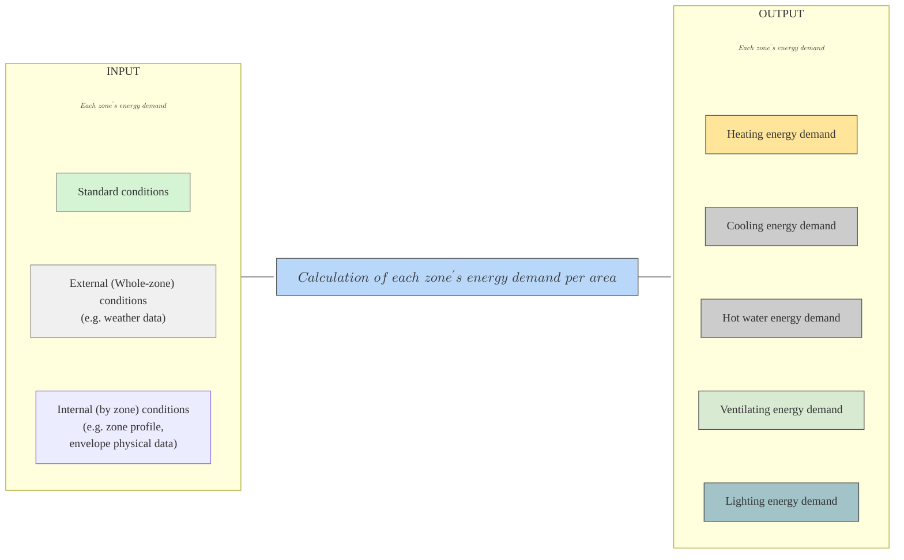

# ECO2 로직 가이드

ECO2는 월별 분석 방식(monthly energy balance method, 줄여서 monthly method라고도 함)을 통해 연간 에너지소요량을 결정합니다.
또한 건물을 여러 개의 존(zone)으로 구획하여, 이를 통해 건물의 에너지소요량을 계산합니다.
따라서 건물의 연간 에너지소요량은 개념적으로 각 존별 월별 에너지소요량의 12개월치의 합산값으로 결정됩니다.

<h6> To 희: 냉방에너지요구량 및 난방에너지요구량에 있는 관련 내용 및 그림 이쪽으로 복사해서 어울리게 편집해주세요!  </h6>

###### 추후 목차 다이어그램으로 만들어주세요!   

3. 건물의 조닝    

3.1 조닝에 대한 일반사항   

3.2 건물의 존 분할   

3.2.1 운전프로필에 따른 조닝   

3.2.2 추가적 존 분할지침에 따른 조닝   

3.2.3 시스템의 공급범위   

3.3 분석결과에 대한 결산   

3.3.1 결산   

3.3.2 존의 열획득원, 열손실원 및 에너지요구량 산정   

3.3.3 2차 에너지요구량과 열획득 및 열손실 산정   

4. 건물 모델링 프로세스   

4.1 기호, 단위 및 인덱스   

4.2 입출력데이터   

4.2.1 입력데이터   

4.2.2 연계되는 출력 데이터   

4.3 월별 분석방식   

4.3.1 일반사항   

4.3.2 존의 난방부하와 냉방부하 분석   

4.3.3 열손실   

4.3.4 열획득   

4.3.5 획득열 이용률 (획득된 열의 이용률)   

4.4 월별 분석방식에서 개별 값의 산정   

4.4.1 실내온도   

4.4.2 전도에 의한 열손실 및 열획득   

4.4.3 환기에 읳나 열손실 및 열획득   

4.4.4 태양열에 의한 열획득 및 열손실   

4.4.5 내부 열 및 냉열획득원   

4.4.6 열획득원의 이용효율   

5. 공조처리에너지 모델링 프로세스   

5.1 기호, 단위 및 인덱스   

5.2 분석치의 연계   

5.2.1 일반사항   

5.2.2 정풍량방식 공조기의 급기풍량   

5.2.3 시간-용도에 따라 조절되는 변풍량방식 공조기의 급기유량   

5.2.4 실내 냉방부하에 따른 변풍량방식 공조기의 급기풍량   

5.2.5 월간 평균 급기온도   

5.3 송풍에 필요한 에너지소요량   

5.3.1 정풍량방식 공조기   

5.3.2 변풍량방식 공조기   

5.4 공조처리(가열, 냉각, 가습, 제습)를 위한 에너지요구량   

5.4.1 공조처리   

5.4.4 공조처리에 필요한 에너지요구량 (5.4.2인듯)   

5.5 최대성능   

5.5.1 외기 및 배기공기의 상태값   

5.5.2 급기공기엔탈피   

5.5.3 최대 가열성능   

5.5.4 최대 냉각성능   

5.5.5 최대 가습성능   

6. 조명에너지 및 조명시스템에너지 모델링 프로세스   

6.1 일반사항   

6.2 조명에너지 요구량   

6.3 조명에너지 산출에 필요한 구성요소   

7. 난방세스팀 에너지모델링   

7.1 기호, 단위 및 Index   

7.2 분석치의 연계   

7.2.1 입력데이터   

7.2.2 출력데이터   

7.3 개별 프로세스에 대한 기본조건 설정   

7.3.1 부하율   

7.3.2 온도   

7.3.3 보일러 정격출력   

7.3.4 시간   

7.4 열 손실 계산   

7.4.1 열 전달   

7.4.2 분배과정에서 발생하는 열손실   

7.4.3 저장과정에서 발생하는 열손실   

7.4.4 열 생산기기(보일러)에서 공급되는 열량   

8. 공조 및 냉방시스템 에너지 모델링   

8.1 기호, 단위, 인덱스   

8.2 공조처리에 필요한 에너지요구량   

8.2.1 공조기기 구성요소에 대한 표준치   

8.2.2 공조시스템의 급기온도   

8.2.3 공조시스템 가열유닛의 에너지요구량   

8.3 전달, 분배, 저장   

8.3.1 난방공조   

8.3.2 냉방공조   

8.3.3 실내냉방 팬에 대한 보조에너지   

8.3.4 증기가습 열공급량   

8.3.5 냉각수 및 냉수분배에 대한 보조에너지   

8.3.6 기타 보조에너지(부가적 전동장치)   

8.4 냉열과 증기의 생산에 대한 2차에너지   

8.4.1 냉열 생산에 대한 2차 에너지요구량   

8.4.2 증기공급을 위한 2차에너지   

8.5 에너지소요량   

8.5.1 냉열생산기(냉동기)   

8.5.2 가습에 대한 증기 생산기   

8.5.3 냉방시설과 냉동기에 대한 보조에너지(전력)   

9. 급탕에너지 및 급탕시스템에너지의 모델링 프로세스   

9.1 기호, 단위 및 인덱스   

9.2 급탕에너지 분석   

9.2.1 입력데이터   

9.2.2 출력데이터   

9.3 개별 프로세스에 대한 기본조건 설정   

9.4 개별 프로세스의 열손실량   

9.4.1 전달 열손실   

9.4.2 분배 열손실   

9.4.3 저장 열손실   

9.4.4 생산기기(보일러) 열 공급량   

10. 열병합발전시스템 에너지 모델링 프로세스   

10.1 일반   

10.2 계산   

11. 1차에너지의 모델링프로세스   

11.1 일반   

11.2 1차에너지소요량 분석   

11.2.1 에너지소요량   

11.2.2 1차에너지소요량 평가   

제2절 신재생에너지 평가 알고리즘 개발   

1. 태양열시스템 에너지 소요량 프로세스   

1.1 개요   

1.2 태양열시스템 평가   

1.2.1 태양열시스템이 공급한 열량   

1.2.2 태양열시스템의 공급 열량   

1.2.3 태양열집열시스템에 대한 계산 방식   

2. 태양광발전시스템 에너지 소요량 프로세스    

2.1 개요   

2.2 태양광발전시스템 평가   

2.2.1 태양광발전시스템의 전력 생산량   

2.2.2 입사 일사량   

2.2.3 최대 출력   

2.2.4 시스템 성능 계수   

2.2.5 태양전지모듈의 열 생산   

2.2.6 보조에너지 소비   

2.2.7 시스템의 열적 손실   

2.2.8 열회수시스템의 열적 손실   

3. 히트펌프시스템 에너지 소요량 프로세스   

3.1 개요   

3.2 히트펌프시스템 평가   

3.2.1 계산 방법   

3.2.2 부분부하운전 성능지수(COP)   

3.2.3 열원기기 손실   

3.2.4 전체 에너지수용량의 계산   

3.2.5 보조에너지   

3.2.6 두 번째 열원기기의 에너지수용량(재가열시스템)   

3.2.7 전체 에너지수용량   

3.2.8 재생에너지유입량   

4. 풍력시스템 에너지 모델링   

4.1 개요   

4.2 데이터 요구사항   

4.3 알고리즘   

Explore the following sections:

- [ECO2 사용자 도움말](ECO2_사용자_도움말/ECO2_소개.md)
- [고급 기능](고급_기능/IFC_모델_연동.md)
- [냉방 에너지 분석](냉방_에너지_분석/개요.md)
- [신재생에너지 시스템 분석](신재생에너지_시스템_분석/결과값_해석.md)

---

<h2>프로그램 평가 프로세스</h2>
<h3> Version 1 </h3>

<h3> Version 2 </h3>

\( A\ building's\ energy\ demand\ per\ area\ =\ \sum_{}^{} (Each\ zones'\ energy\ demand\ per\ area) \) 

