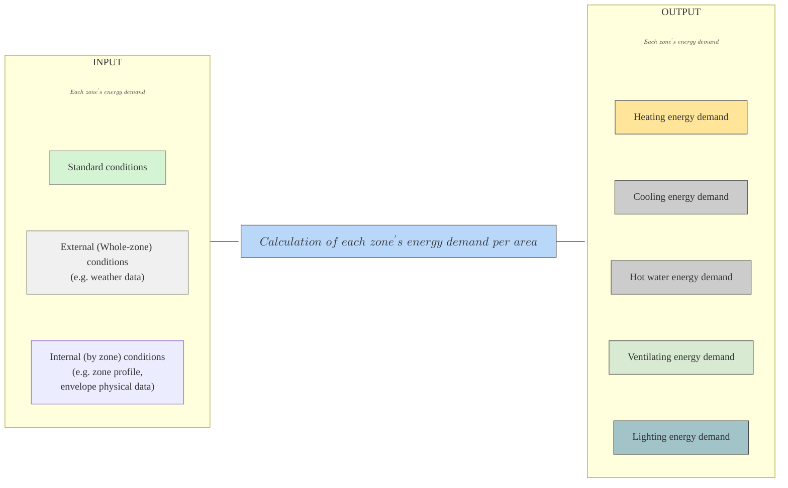

# ECO2 로직 가이드

Explore the following sections:

- [ECO2 사용자 도움말](ECO2_사용자_도움말/ECO2_소개.md)
- [고급 기능](고급_기능/IFC_모델_연동.md)
- [냉방 에너지 분석](냉방_에너지_분석/개요.md)
- [신재생에너지 시스템 분석](신재생에너지_시스템_분석/결과값_해석.md)

---

<h2>프로그램 평가 프로세스</h2>
<h3> Version 1 </h3>

<h3> Version 2 </h3>

\( A\ building's\ energy\ demand\ per\ area\ =\ \sum_{}^{} (Each\ zones'\ energy\ demand\ per\ area) \) 

