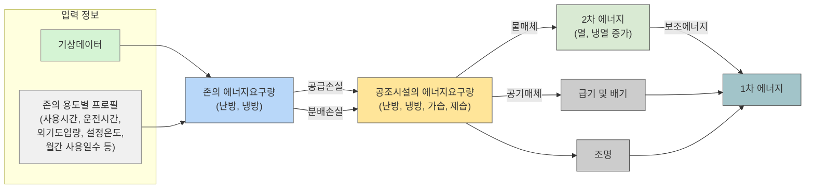
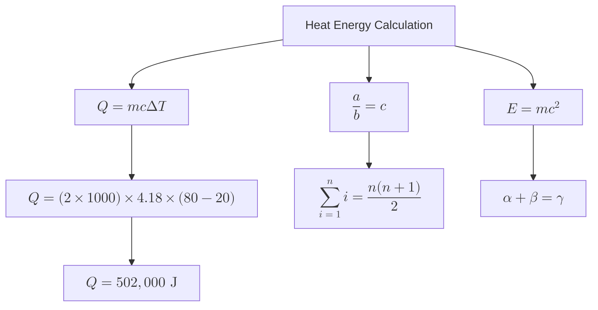
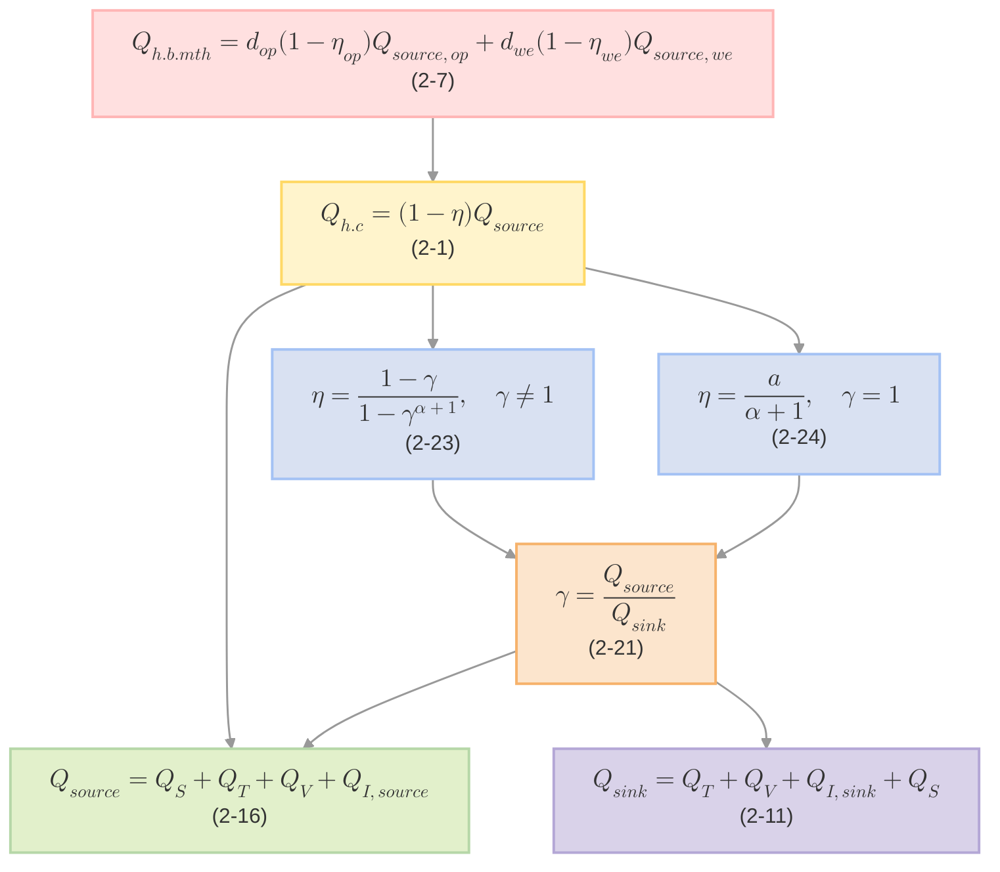
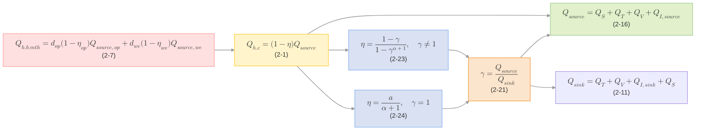
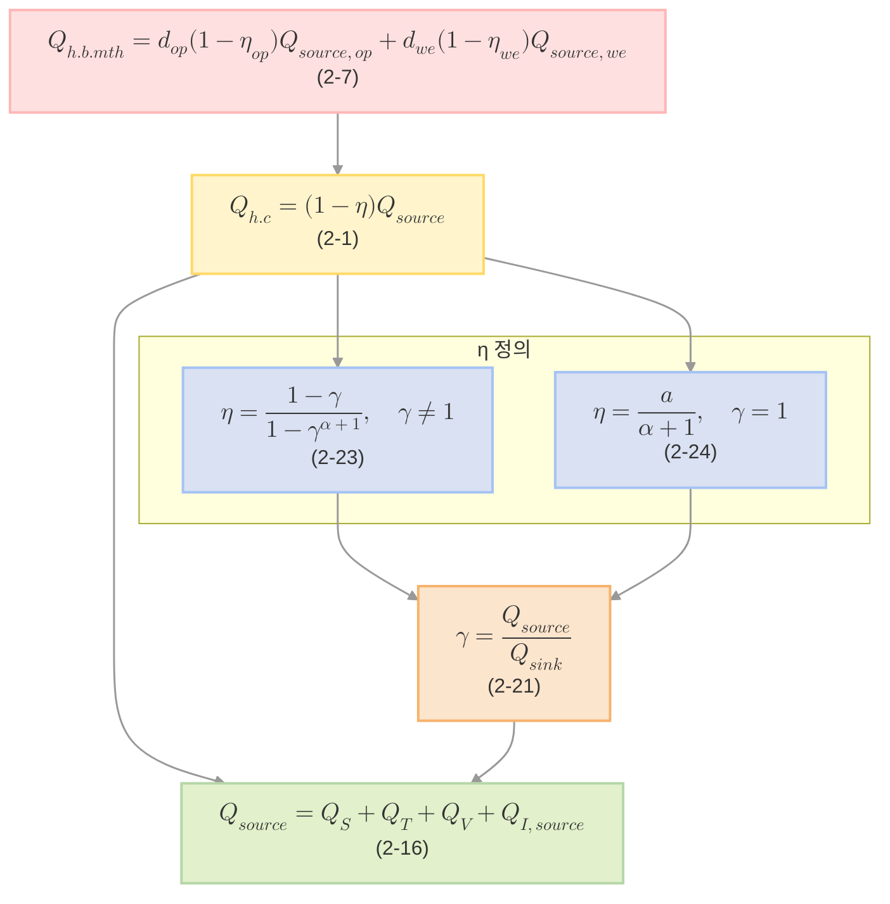
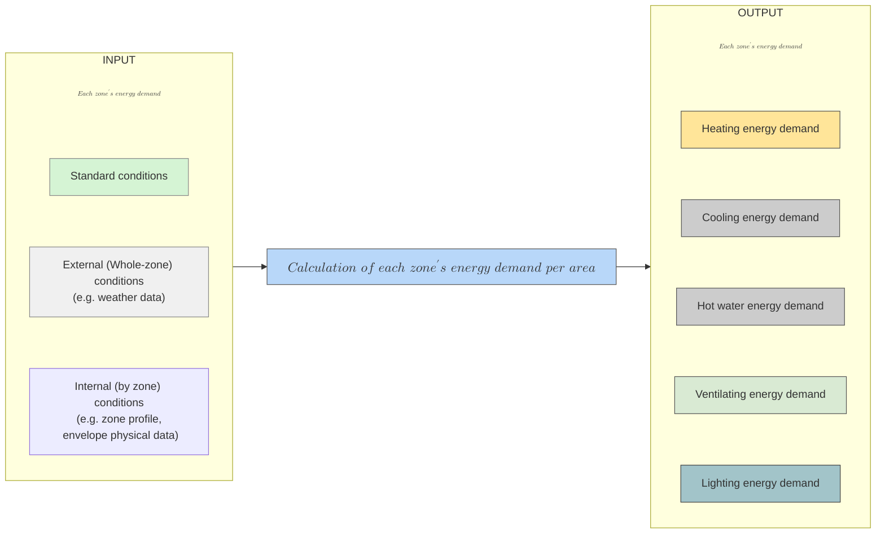
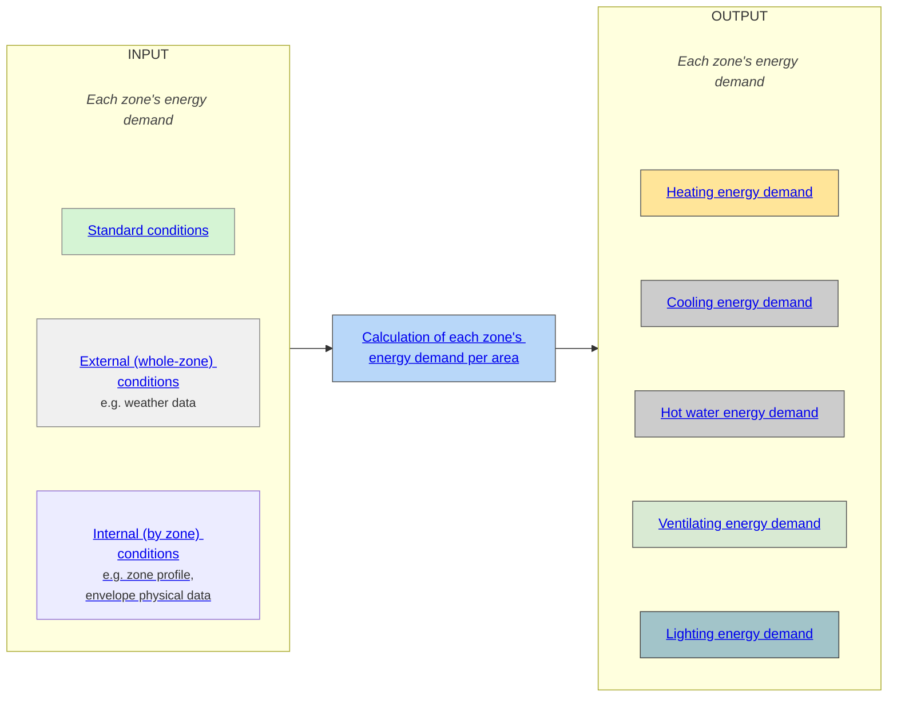
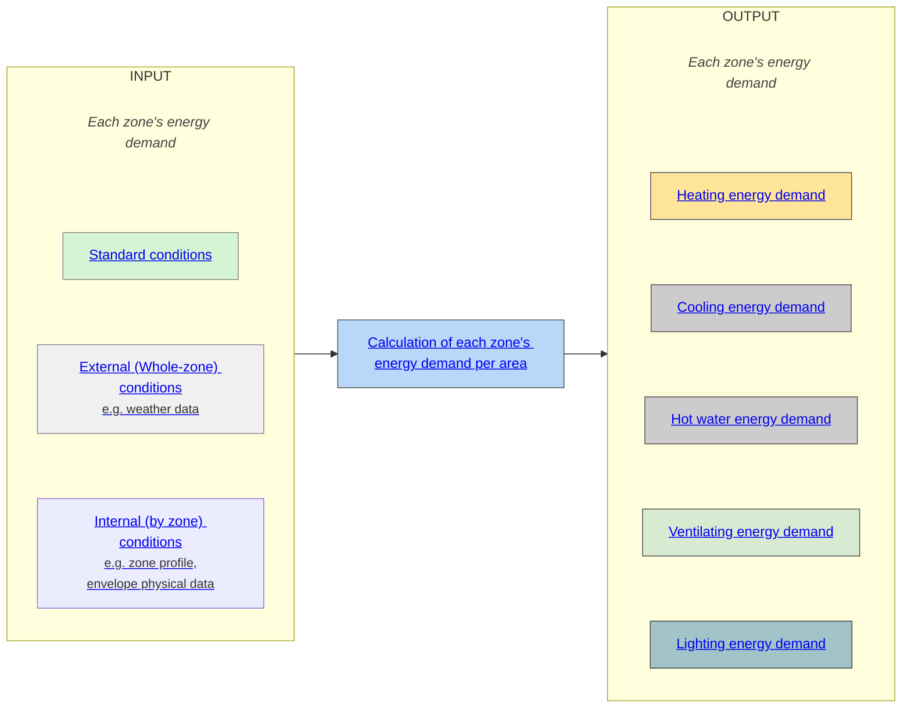

# ECO2 로직 가이드

---
Explore the following sections:

- [ECO2 사용자 도움말](ECO2_사용자_도움말/ECO2_소개.md)
- [고급 기능](고급_기능/IFC_모델_연동.md)
- [냉방 에너지 분석](냉방_에너지_분석/개요.md)
- [신재생에너지 시스템 분석](신재생에너지_시스템_분석/결과값_해석.md)

<!DOCTYPE html>
<html class="no-js" lang="ko">
<head>
  <meta charset="UTF-8">
  <title>프로그램 평가 프로세스</title>
  <!-- Mermaid CDN -->
  
  
</head>
<body>

<h2>프로그램 평가 프로세스</h2>

    flowchart LR
    subgraph Input["입력 정보"]
        A["<a href='weather.html' target='_blank'>기상데이터</a>"]
        B["<a href='profile.html' target='_blank'>존의 용도별 프로필 (사용시간, 운전시간, 외기도입량, 설정온도, 월간 사용일수 등)</a>"]
    end

    A --> C["<a href='energy.html' target='_blank'>존의 에너지요구량 난방, 냉방</a>"]
    B --> C

    C -->|공급손실| D1["<a href='hvac.html' target='_blank'>공조시설의 에너지요구량 난방, 냉방, 가습, 제습</a>"]
    C -->|분배손실| D1

    D1 -->|공기매체| E1["<a href='air.html' target='_blank'>급기 및 배기</a>"]
    D1 --> F1["<a href='lighting.html' target='_blank'>조명</a>"]

    D1 -->|물매체| G1["<a href='secondary.html' target='_blank'>2차 에너지 열, 냉열 증가</a>"]
    G1 -->|보조에너지| H1["<a href='primary.html' target='_blank'>1차 에너지</a>"]
    E1 --> H1
    F1 --> H1

    style A fill:#d5f4d4,stroke:#888,stroke-width:1px
    style B fill:#f0f0f0,stroke:#888,stroke-width:1px
    style C fill:#b8d7f9,stroke:#555,stroke-width:1px
    style D1 fill:#ffe599,stroke:#555,stroke-width:1px
    style E1 fill:#ccc,stroke:#555
    style F1 fill:#ccc,stroke:#555
    style G1 fill:#d9ead3,stroke:#555
    style H1 fill:#a2c4c9,stroke:#444

    linkStyle default stroke:#333,stroke-width:1px

</body>
</html>

# 프로그램 평가 프로세스

# Equation Diagram 
## 🔹 (Temporarily) Cooling Energy Demand Only
---

## Hee-Mind map sample
---

###TB ver.

###LR ver.

###TB+LR ver.

# 프로그램 평가 프로세스

\( A\ building's\ energy\ demand\ per\ area\ =\ \sum_{}^{} (Each\ zones'\ energy\ demand\ per\ area) \) 

# 프로그램 평가 프로세스

\( A\ building's\ energy\ demand\ per\ area\ =\ \sum_{}^{} (Each\ zones'\ energy\ demand\ per\ area) \)

# 프로그램 평가 프로세스

\( A\ building's\ energy\ demand\ per\ area\ =\ \sum_{}^{} (Each\ zones'\ energy\ demand\ per\ area) \)

