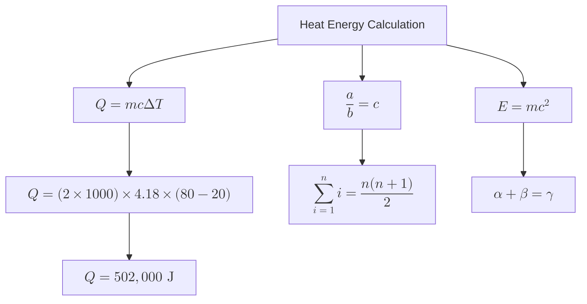
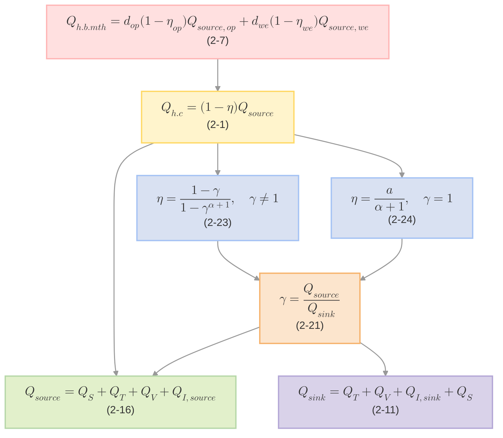
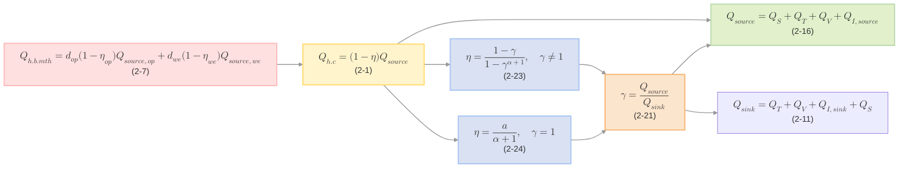
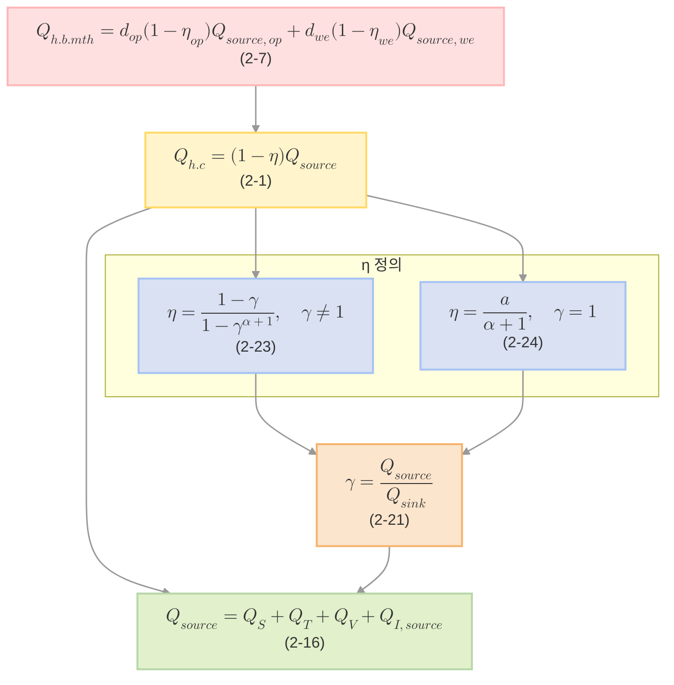
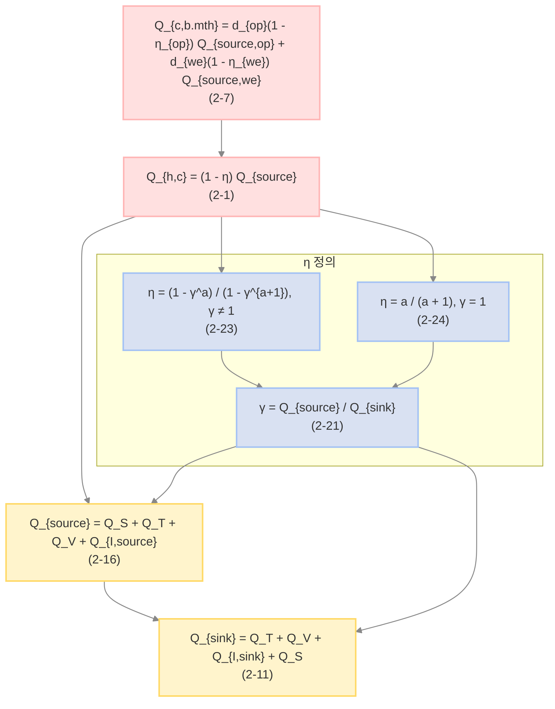
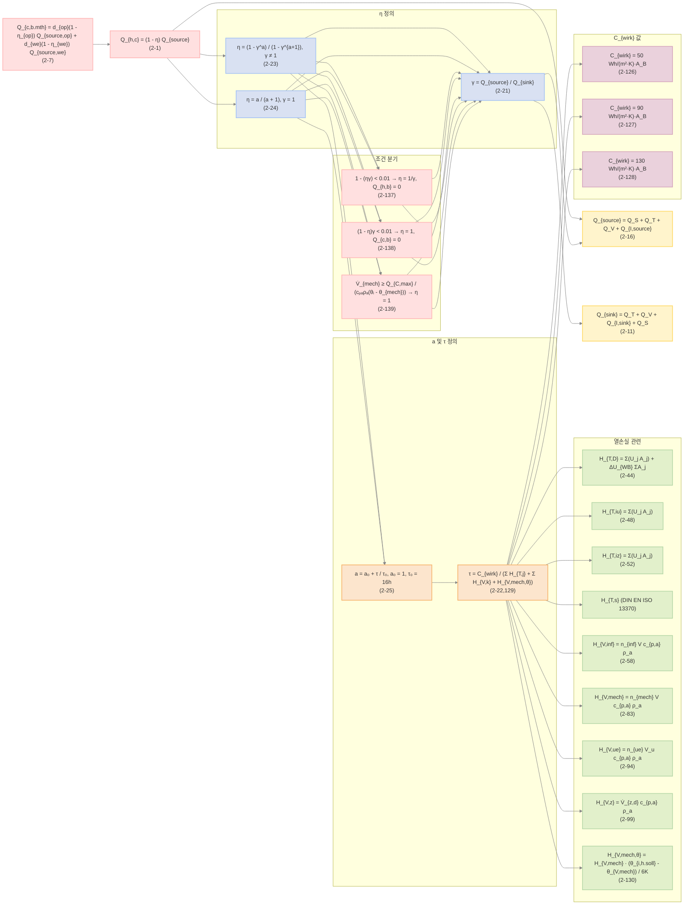

# Equation Diagram 
## 🔹 (Temporarily) Cooling Energy Demand Only
---

```mermaid
graph TD
    A["Heat Energy Calculation"] --> B["<div>$$Q = mc\Delta T$$</div>"]
    B --> C["<div>$$Q = (2 \times 1000) \times 4.18 \times (80 - 20)$$</div>"]
    C --> D["<div>$$Q = 502,000 \text{ J}$$</div>"]

    A --> E["<div>$$\frac{a}{b} = c$$</div>"]
    E --> F["<div>$$\sum_{i=1}^{n} i = \frac{n(n+1)}{2}$$</div>"]

    A --> G["<div>$$E = mc^2$$</div>"]
    G --> H["<div>$$\alpha + \beta = \gamma$$</div>"]
```

## Hee-Mind map sample
---

###TB ver.

```mermaid
graph TB

A["<div>$$Q_{h.b.mth} = d_{op}(1 - \eta_{op}) Q_{source,op} + d_{we}(1 - \eta_{we}) Q_{source,we}$$<br/>(2-7)</div>"]

B["<div>$$Q_{h.c} = (1 - \eta) Q_{source}$$<br/>(2-1)</div>"]

C["<div>$$Q_{source} = Q_S + Q_T + Q_V + Q_{I,source}$$<br/>(2-16)</div>"]

D["<div>$$\eta = \frac{1 - \gamma}{1 - \gamma^{\alpha + 1}}, \quad \gamma \neq 1$$<br/>(2-23)</div>"]

E["<div>$$\eta = \frac{a}{\alpha + 1}, \quad \gamma = 1$$<br/>(2-24)</div>"]

F["<div>$$\gamma = \frac{Q_{source}}{Q_{sink}}$$<br/>(2-21)</div>"]

G["<div>$$Q_{sink} = Q_T + Q_V + Q_{I,sink} + Q_S$$<br/>(2-11)</div>"]

%% 관계 연결
A --> B
B --> C
B --> D
B --> E
D --> F
E --> F
F --> C
F --> G

%% 노드 스타일
style A fill:#FFE0E0,stroke:#FFB6B6,stroke-width:2px
style B fill:#FFF4CC,stroke:#FFD966,stroke-width:2px
style C fill:#E2F0CB,stroke:#B6D7A8,stroke-width:2px
style D fill:#D9E1F2,stroke:#A4C2F4,stroke-width:2px
style E fill:#D9E1F2,stroke:#A4C2F4,stroke-width:2px
style F fill:#FCE5CD,stroke:#F6B26B,stroke-width:2px
style G fill:#D9D2E9,stroke:#B4A7D6,stroke-width:2px

%% 전체 링크 스타일
linkStyle default stroke:#999,stroke-width:1.5px

```

###LR ver.

```mermaid
graph LR

%% 노드 정의
A["<div>$$Q_{h.b.mth} = d_{op}(1 - \eta_{op}) Q_{source,op} + d_{we}(1 - \eta_{we}) Q_{source,we}$$<br/>(2-7)</div>"]

B["<div>$$Q_{h.c} = (1 - \eta) Q_{source}$$<br/>(2-1)</div>"]

C["<div>$$Q_{source} = Q_S + Q_T + Q_V + Q_{I,source}$$<br/>(2-16)</div>"]

D["<div>$$\eta = \frac{1 - \gamma}{1 - \gamma^{\alpha + 1}}, \quad \gamma \neq 1$$<br/>(2-23)</div>"]

E["<div>$$\eta = \frac{a}{\alpha + 1}, \quad \gamma = 1$$<br/>(2-24)</div>"]

F["<div>$$\gamma = \frac{Q_{source}}{Q_{sink}}$$<br/>(2-21)</div>"]

G["<div>$$Q_{sink} = Q_T + Q_V + Q_{I,sink} + Q_S$$<br/>(2-11)</div>"]

%% 관계 연결
A --> B
B --> C
B --> D
B --> E
D --> F
E --> F
F --> C
F --> G

%% 노드 스타일
style A fill:#FFE0E0,stroke:#FFB6B6,stroke-width:2px
style B fill:#FFF4CC,stroke:#FFD966,stroke-width:2px
style C fill:#E2F0CB,stroke:#B6D7A8,stroke-width:2px
style D fill:#D9E1F2,stroke:#A4C2F4,stroke-width:2px
style E fill:#D9E1F2,stroke:#A4C2F4,stroke-width:2px
style F fill:#FCE5CD,stroke:#F6B26B,stroke-width:2px

%% 전체 그래프 스타일
linkStyle default stroke:#999,stroke-width:1.5px
```

###TB+LR ver.

```mermaid
graph TB

%% 상단 주요 흐름 (세로)
A["<div>$$Q_{h.b.mth} = d_{op}(1 - \eta_{op}) Q_{source,op} + d_{we}(1 - \eta_{we}) Q_{source,we}$$<br/>(2-7)</div>"]

B["<div>$$Q_{h.c} = (1 - \eta) Q_{source}$$<br/>(2-1)</div>"]

C["<div>$$Q_{source} = Q_S + Q_T + Q_V + Q_{I,source}$$<br/>(2-16)</div>"]

F["<div>$$\gamma = \frac{Q_{source}}{Q_{sink}}$$<br/>(2-21)</div>"]


A --> B
B --> C
F --> C

%% η 관련 수식 (가로 subgraph로 묶기)
subgraph ETA["η 정의"]
  direction LR
  D["<div>$$\eta = \frac{1 - \gamma}{1 - \gamma^{\alpha + 1}}, \quad \gamma \neq 1$$<br/>(2-23)</div>"]
  E["<div>$$\eta = \frac{a}{\alpha + 1}, \quad \gamma = 1$$<br/>(2-24)</div>"]
end

B --> D
B --> E
D --> F
E --> F

%% 노드 스타일
style A fill:#FFE0E0,stroke:#FFB6B6,stroke-width:2px
style B fill:#FFF4CC,stroke:#FFD966,stroke-width:2px
style C fill:#E2F0CB,stroke:#B6D7A8,stroke-width:2px
style D fill:#D9E1F2,stroke:#A4C2F4,stroke-width:2px
style E fill:#D9E1F2,stroke:#A4C2F4,stroke-width:2px
style F fill:#FCE5CD,stroke:#F6B26B,stroke-width:2px

linkStyle default stroke:#999,stroke-width:1.5px
```

```mermaid
graph TB

%% 상단 주요 흐름 (세로)
A1["Q_{c,b.mth} = d_{op}(1 - η_{op}) Q_{source,op} + d_{we}(1 - η_{we}) Q_{source,we}\n(2-7)"]
A2["Q_{h,c} = (1 - η) Q_{source}\n(2-1)"]
A3["Q_{source} = Q_S + Q_T + Q_V + Q_{I,source}\n(2-16)"]
A4["Q_{sink} = Q_T + Q_V + Q_{I,sink} + Q_S\n(2-11)"]

A1 --> A2
A2 --> A3
A3 --> A4

subgraph ETA["η 정의"]
  direction LR
  B1["η = (1 - γ^a) / (1 - γ^{a+1}), γ ≠ 1\n(2-23)"]
  B2["η = a / (a + 1), γ = 1\n(2-24)"]
  B3["γ = Q_{source} / Q_{sink}\n(2-21)"]
end

A2 --> B1
A2 --> B2
B1 --> B3
B2 --> B3
B3 --> A3
B3 --> A4

classDef red fill:#FFE0E0,stroke:#FFB6B6,stroke-width:2px;
classDef yellow fill:#FFF4CC,stroke:#FFD966,stroke-width:2px;
classDef blue fill:#D9E1F2,stroke:#A4C2F4,stroke-width:2px;

class A1,A2 red
class A3,A4 yellow
class B1,B2,B3 blue

linkStyle default stroke:#888,stroke-width:1.2px;
```

### 존의 냉방부하

```mermaid
graph TB

%% 상단 주요 흐름 (세로)
A1["Q_{c,b.mth} = d_{op}(1 - η_{op}) Q_{source,op} + d_{we}(1 - η_{we}) Q_{source,we}\n(2-7)"]
A2["Q_{h,c} = (1 - η) Q_{source}\n(2-1)"]
A3["Q_{source} = Q_S + Q_T + Q_V + Q_{I,source}\n(2-16)"]
A4["Q_{sink} = Q_T + Q_V + Q_{I,sink} + Q_S\n(2-11)"]

A1 --> A2
A2 --> A3


%% η 관련 수식
subgraph ETA["η 정의"]
  direction LR
  B1["η = (1 - γ^a) / (1 - γ^{a+1}), γ ≠ 1\n(2-23)"]
  B2["η = a / (a + 1), γ = 1\n(2-24)"]
  B3["γ = Q_{source} / Q_{sink}\n(2-21)"]
end

A2 --> B1
A2 --> B2
B1 --> B3
B2 --> B3
B3 --> A3
B3 --> A4

%% a, τ 정의 및 흐름
subgraph TAU["a 및 τ 정의"]
  direction TB
  C1["a = a₀ + τ / τ₀, a₀ = 1, τ₀ = 16h\n(2-25)"]
  C2["τ = C_{wirk} / (Σ H_{T,j} + Σ H_{V,k} + H_{V,mech,θ})\n(2-22,129)"]
end

B1 --> C1
B2 --> C1
C1 --> C2

%% H_T, H_V, C_wirk 정의
subgraph HEAT_LOSS["열손실 관련"]
  direction TB
  D1["H_{T,D} = Σ(U_j A_j) + ΔU_{WB} ΣA_j\n(2-44)"]
  D2["H_{T,iu} = Σ(U_j A_j)\n(2-48)"]
  D3["H_{T,iz} = Σ(U_j A_j)\n(2-52)"]
  D4["H_{T,s} (DIN EN ISO 13370)"]
  E1["H_{V,inf} = n_{inf} V c_{p,a} ρ_a\n(2-58)"]
  E2["H_{V,mech} = n_{mech} V c_{p,a} ρ_a\n(2-83)"]
  E3["H_{V,ue} = n_{ue} V_u c_{p,a} ρ_a\n(2-94)"]
  E4["H_{V,z} = V̇_{z,d} c_{p,a} ρ_a\n(2-99)"]
  E5["H_{V,mech,θ} = H_{V,mech} · (θ_{i,h.soll} - θ_{V,mech}) / 6K\n(2-130)"]
end

C2 --> D1
C2 --> D2
C2 --> D3
C2 --> D4
C2 --> E1
C2 --> E2
C2 --> E3
C2 --> E4
C2 --> E5

%% C_wirk 값
subgraph CWIRK["C_{wirk} 값"]
  direction LR
  F1["C_{wirk} = 50 Wh/(m²·K)·A_B\n(2-126)"]
  F2["C_{wirk} = 90 Wh/(m²·K)·A_B\n(2-127)"]
  F3["C_{wirk} = 130 Wh/(m²·K)·A_B\n(2-128)"]
end
C2 --> F1
C2 --> F2
C2 --> F3

%% 조건 분기
G1["1 - (ηγ) < 0.01 → η = 1/γ, Q_{h,b} = 0\n(2-137)"]
G2["(1 - η)γ < 0.01 → η = 1, Q_{c,b} = 0\n(2-138)"]
G3["V̇_{mech} ≥ Q̇_{C,max} / (cₚₐρₐ(θᵢ - θ_{mech})) → η = 1\n(2-139)"]

B1 --> G1
B1 --> G2
B1 --> G3
B2 --> G1
B2 --> G2
B2 --> G3
G1 --> B3
G2 --> B3
G3 --> B3

%% 스타일 정의
classDef red fill:#FFE0E0,stroke:#FFB6B6,stroke-width:2px;
classDef yellow fill:#FFF4CC,stroke:#FFD966,stroke-width:2px;
classDef green fill:#E2F0CB,stroke:#B6D7A8,stroke-width:2px;
classDef blue fill:#D9E1F2,stroke:#A4C2F4,stroke-width:2px;
classDef orange fill:#FCE5CD,stroke:#F6B26B,stroke-width:2px;
classDef violet fill:#EAD1DC,stroke:#D5A6BD,stroke-width:2px;

class A1,A2 red
class A3,A4 yellow
class B1,B2,B3 blue
class C1,C2 orange
class D1,D2,D3,D4,E1,E2,E3,E4,E5 green
class F1,F2,F3 violet
class G1,G2,G3 red

linkStyle default stroke:#888,stroke-width:1.2px;
```

```mermaid
graph TB

%% 상단 주요 흐름 (세로)
A1["Q_{c,b.mth} = d_{op}(1 - η_{op}) Q_{source,op} + d_{we}(1 - η_{we}) Q_{source,we}\n(2-7)"]
A2["Q_{h,c} = (1 - η) Q_{source}\n(2-1)"]
A3["Q_{source} = Q_S + Q_T + Q_V + Q_{I,source}\n(2-16)"]
A4["Q_{sink} = Q_T + Q_V + Q_{I,sink} + Q_S\n(2-11)"]

A1 --> A2
A2 --> A3

%% η 관련 수식
subgraph ETA["η 정의"]
  direction TB
  B1["η = (1 - γ^a) / (1 - γ^{a+1}), γ ≠ 1\n(2-23)"]
  B2["η = a / (a + 1), γ = 1\n(2-24)"]
  B3["γ = Q_{source} / Q_{sink}\n(2-21)"]
end

A2 --> B1
A2 --> B2
B1 --> B3
B2 --> B3
B3 --> A3
B3 --> A4

%% a, τ 정의 및 흐름
subgraph TAU["a 및 τ 정의"]
  direction TB
  C1["a = a₀ + τ / τ₀, a₀ = 1, τ₀ = 16h\n(2-25)"]
  C2["τ = C_{wirk} / (Σ H_{T,j} + Σ H_{V,k} + H_{V,mech,θ})\n(2-22,129)"]
end

B1 --> C1
B2 --> C1
C1 --> C2

%% H_T, H_V, C_wirk 정의
subgraph HEAT_LOSS["열손실 관련"]
  direction TB
  D1["H_{T,D} = Σ(U_j A_j) + ΔU_{WB} ΣA_j\n(2-44)"]
  D2["H_{T,iu} = Σ(U_j A_j)\n(2-48)"]
  D3["H_{T,iz} = Σ(U_j A_j)\n(2-52)"]
  D4["H_{T,s} (DIN EN ISO 13370)"]
  E1["H_{V,inf} = n_{inf} V c_{p,a} ρ_a\n(2-58)"]
  E2["H_{V,mech} = n_{mech} V c_{p,a} ρ_a\n(2-83)"]
  E3["H_{V,ue} = n_{ue} V_u c_{p,a} ρ_a\n(2-94)"]
  E4["H_{V,z} = V̇_{z,d} c_{p,a} ρ_a\n(2-99)"]
  E5["H_{V,mech,θ} = H_{V,mech} · (θ_{i,h.soll} - θ_{V,mech}) / 6K\n(2-130)"]
end

C2 --> D1
C2 --> D2
C2 --> D3
C2 --> D4
C2 --> E1
C2 --> E2
C2 --> E3
C2 --> E4
C2 --> E5

%% C_wirk 값
subgraph CWIRK["C_{wirk} 값"]
  direction TB
  F1["C_{wirk} = 50 Wh/(m²·K)·A_B\n(2-126)"]
  F2["C_{wirk} = 90 Wh/(m²·K)·A_B\n(2-127)"]
  F3["C_{wirk} = 130 Wh/(m²·K)·A_B\n(2-128)"]
end

C2 --> F1
C2 --> F2
C2 --> F3

%% 조건 분기
subgraph CONDITION["조건 분기"]
  direction TB
  G1["1 - (ηγ) < 0.01 → η = 1/γ, Q_{h,b} = 0\n(2-137)"]
  G2["(1 - η)γ < 0.01 → η = 1, Q_{c,b} = 0\n(2-138)"]
  G3["V̇_{mech} ≥ Q̇_{C,max} / (cₚₐρₐ(θᵢ - θ_{mech})) → η = 1\n(2-139)"]
end

B1 --> G1
B1 --> G2
B1 --> G3
B2 --> G1
B2 --> G2
B2 --> G3
G1 --> B3
G2 --> B3
G3 --> B3

%% 스타일 정의
classDef red fill:#FFE0E0,stroke:#FFB6B6,stroke-width:2px;
classDef yellow fill:#FFF4CC,stroke:#FFD966,stroke-width:2px;
classDef green fill:#E2F0CB,stroke:#B6D7A8,stroke-width:2px;
classDef blue fill:#D9E1F2,stroke:#A4C2F4,stroke-width:2px;
classDef orange fill:#FCE5CD,stroke:#F6B26B,stroke-width:2px;
classDef violet fill:#EAD1DC,stroke:#D5A6BD,stroke-width:2px;

class A1,A2 red
class A3,A4 yellow
class B1,B2,B3 blue
class C1,C2 orange
class D1,D2,D3,D4,E1,E2,E3,E4,E5 green
class F1,F2,F3 violet
class G1,G2,G3 red

linkStyle default stroke:#888,stroke-width:1.2px;
```

```mermaid
graph TB

%% 상단 주요 흐름 (세로)
A1["Q_{c,b.mth} = d_{op}(1 - η_{op}) Q_{source,op} + d_{we}(1 - η_{we}) Q_{source,we}\n(2-7)"]
A2["Q_{h,c} = (1 - η) Q_{source}\n(2-1)"]
A3["Q_{source} = Q_S + Q_T + Q_V + Q_{I,source}\n(2-16)"]
A4["Q_{sink} = Q_T + Q_V + Q_{I,sink} + Q_S\n(2-11)"]

A1 --> A2
A2 --> A3

%% η 관련 수식
subgraph ETA["η 정의"]
  direction TB
  B1["η = (1 - γ^a) / (1 - γ^{a+1}), γ ≠ 1\n(2-23)"]
  B2["η = a / (a + 1), γ = 1\n(2-24)"]
  B3["γ = Q_{source} / Q_{sink}\n(2-21)"]
end

A2 --> B1
A2 --> B2
B1 --> B3
B2 --> B3
B3 --> A3
B3 --> A4

%% 조건 분기
subgraph CONDITION["조건 분기"]
  direction TB
  G1["1 - (ηγ) < 0.01 → η = 1/γ, Q_{h,b} = 0\n(2-137)"]
  G2["(1 - η)γ < 0.01 → η = 1, Q_{c,b} = 0\n(2-138)"]
  G3["V̇_{mech} ≥ Q̇_{C,max} / (cₚₐρₐ(θᵢ - θ_{mech})) → η = 1\n(2-139)"]
end

B1 --> G1
B1 --> G2
B1 --> G3
B2 --> G1
B2 --> G2
B2 --> G3
G1 --> B3
G2 --> B3
G3 --> B3

%% a, τ 정의 및 흐름
subgraph TAU["a 및 τ 정의"]
  direction TB
  C1["a = a₀ + τ / τ₀, a₀ = 1, τ₀ = 16h\n(2-25)"]
  C2["τ = C_{wirk} / (Σ H_{T,j} + Σ H_{V,k} + H_{V,mech,θ})\n(2-22,129)"]
end

B1 --> C1
B2 --> C1
C1 --> C2

%% H_T, H_V, C_wirk 정의
subgraph HEAT_LOSS["열손실 및 C_{wirk}"]
  direction TB
  D1["H_{T,D} = Σ(U_j A_j) + ΔU_{WB} ΣA_j\n(2-44)"]
  D2["H_{T,iu} = Σ(U_j A_j)\n(2-48)"]
  D3["H_{T,iz} = Σ(U_j A_j)\n(2-52)"]
  D4["H_{T,s} (DIN EN ISO 13370)"]
  E1["H_{V,inf} = n_{inf} V c_{p,a} ρ_a\n(2-58)"]
  E2["H_{V,mech} = n_{mech} V c_{p,a} ρ_a\n(2-83)"]
  E3["H_{V,ue} = n_{ue} V_u c_{p,a} ρ_a\n(2-94)"]
  E4["H_{V,z} = V̇_{z,d} c_{p,a} ρ_a\n(2-99)"]
  E5["H_{V,mech,θ} = H_{V,mech} · (θ_{i,h.soll} - θ_{V,mech}) / 6K\n(2-130)"]
  F1["C_{wirk} = 50 Wh/(m²·K)·A_B\n(2-126)"]
  F2["C_{wirk} = 90 Wh/(m²·K)·A_B\n(2-127)"]
  F3["C_{wirk} = 130 Wh/(m²·K)·A_B\n(2-128)"]
end

C2 --> D1
C2 --> D2
C2 --> D3
C2 --> D4
C2 --> E1
C2 --> E2
C2 --> E3
C2 --> E4
C2 --> E5
C2 --> F1
C2 --> F2
C2 --> F3

%% 스타일 정의
classDef red fill:#FFE0E0,stroke:#FFB6B6,stroke-width:2px;
classDef yellow fill:#FFF4CC,stroke:#FFD966,stroke-width:2px;
classDef green fill:#E2F0CB,stroke:#B6D7A8,stroke-width:2px;
classDef blue fill:#D9E1F2,stroke:#A4C2F4,stroke-width:2px;
classDef orange fill:#FCE5CD,stroke:#F6B26B,stroke-width:2px;
classDef violet fill:#EAD1DC,stroke:#D5A6BD,stroke-width:2px;

class A1,A2 red
class A3,A4 yellow
class B1,B2,B3 blue
class C1,C2 orange
class D1,D2,D3,D4,E1,E2,E3,E4,E5 green
class F1,F2,F3 violet
class G1,G2,G3 red

linkStyle default stroke:#888,stroke-width:1.2px;
```

```mermaid
graph LR

%% 상단 주요 흐름 (가로)
A1["Q_{c,b.mth} = d_{op}(1 - η_{op}) Q_{source,op} + d_{we}(1 - η_{we}) Q_{source,we}\n(2-7)"]
A2["Q_{h,c} = (1 - η) Q_{source}\n(2-1)"]
A3["Q_{source} = Q_S + Q_T + Q_V + Q_{I,source}\n(2-16)"]
A4["Q_{sink} = Q_T + Q_V + Q_{I,sink} + Q_S\n(2-11)"]

A1 --> A2 --> A3

%% η 관련 수식
subgraph ETA["η 정의"]
  direction TB
  B1["η = (1 - γ^a) / (1 - γ^{a+1}), γ ≠ 1\n(2-23)"]
  B2["η = a / (a + 1), γ = 1\n(2-24)"]
  B3["γ = Q_{source} / Q_{sink}\n(2-21)"]
 end

A2 --> B1
A2 --> B2
B1 --> B3
B2 --> B3
B3 --> A3
B3 --> A4

%% a, τ 정의 및 흐름
subgraph TAU["a 및 τ 정의"]
  direction LR
  C1["a = a₀ + τ / τ₀, a₀ = 1, τ₀ = 16h\n(2-25)"]
  C2["τ = C_{wirk} / (Σ H_{T,j} + Σ H_{V,k} + H_{V,mech,θ})\n(2-22,129)"]
end

B1 --> C1
B2 --> C1
C1 --> C2

%% H_T, H_V, C_wirk 정의
subgraph HEAT_LOSS["열손실 관련"]
  direction LR
  D1["H_{T,D} = Σ(U_j A_j) + ΔU_{WB} ΣA_j\n(2-44)"]
  D2["H_{T,iu} = Σ(U_j A_j)\n(2-48)"]
  D3["H_{T,iz} = Σ(U_j A_j)\n(2-52)"]
  D4["H_{T,s} (DIN EN ISO 13370)"]
  E1["H_{V,inf} = n_{inf} V c_{p,a} ρ_a\n(2-58)"]
  E2["H_{V,mech} = n_{mech} V c_{p,a} ρ_a\n(2-83)"]
  E3["H_{V,ue} = n_{ue} V_u c_{p,a} ρ_a\n(2-94)"]
  E4["H_{V,z} = V̇_{z,d} c_{p,a} ρ_a\n(2-99)"]
  E5["H_{V,mech,θ} = H_{V,mech} · (θ_{i,h.soll} - θ_{V,mech}) / 6K\n(2-130)"]
end

C2 --> D1
C2 --> D2 
C2 --> D3 
C2 --> D4 
C2 --> E1 
C2 --> E2 
C2 --> E3 
C2 --> E4 
C2 --> E5

%% C_wirk 값
subgraph CWIRK["C_{wirk} 값"]
  direction TB
  F1["C_{wirk} = 50 Wh/(m²·K)·A_B\n(2-126)"]
  F2["C_{wirk} = 90 Wh/(m²·K)·A_B\n(2-127)"]
  F3["C_{wirk} = 130 Wh/(m²·K)·A_B\n(2-128)"]
end

C2 --> F1
C2 --> F2
C2 --> F3

%% 조건 분기
subgraph CONDITIONS["조건 분기"]
  direction TB
  G1["1 - (ηγ) < 0.01 → η = 1/γ, Q_{h,b} = 0\n(2-137)"]
  G2["(1 - η)γ < 0.01 → η = 1, Q_{c,b} = 0\n(2-138)"]
  G3["V̇_{mech} ≥ Q̇_{C,max} / (cₚₐρₐ(θᵢ - θ_{mech})) → η = 1\n(2-139)"]
end

B1 --> G1 --> B3
B1 --> G2 --> B3
B1 --> G3 --> B3
B2 --> G1 --> B3
B2 --> G2 --> B3
B2 --> G3 --> B3

%% 스타일 정의
classDef red fill:#FFE0E0,stroke:#FFB6B6,stroke-width:2px;
classDef yellow fill:#FFF4CC,stroke:#FFD966,stroke-width:2px;
classDef green fill:#E2F0CB,stroke:#B6D7A8,stroke-width:2px;
classDef blue fill:#D9E1F2,stroke:#A4C2F4,stroke-width:2px;
classDef orange fill:#FCE5CD,stroke:#F6B26B,stroke-width:2px;
classDef violet fill:#EAD1DC,stroke:#D5A6BD,stroke-width:2px;

class A1,A2 red
class A3,A4 yellow
class B1,B2,B3 blue
class C1,C2 orange
class D1,D2,D3,D4,E1,E2,E3,E4,E5 green
class F1,F2,F3 violet
class G1,G2,G3 red

linkStyle default stroke:#888,stroke-width:1.2px;
```